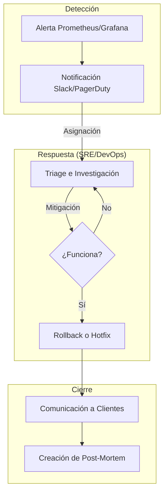

# Guía de Gestión de Incidentes y Post-Mortems (Capa 27 de FastFlow)

En **FastFlow**, aceptamos que los fallos son inevitables en sistemas complejos. La diferencia entre una organización mediocre y una de alto rendimiento es cómo responde a esos fallos y qué aprende de ellos.

## 1. Clasificación de Incidentes (Severidad)
-   **SEV-1 (Crítico)**: Producción caída o pérdida de datos. Respuesta inmediata (24/7).
-   **SEV-2 (Alto)**: Funcionalidad principal afectada para un grupo de usuarios. Respuesta en < 1 hora.
-   **SEV-3 (Medio)**: Fallo cosmético o funcionalidad secundaria afectada. Respuesta en horario laboral.

## 2. Flujo de Respuesta de FastFlow

## 3. El Post-Mortem "Blameless" (Sin Culpa)
El objetivo de un Post-Mortem en FastFlow no es encontrar culpables, sino identificar debilidades en el sistema.
-   **Timeline**: ¿Qué pasó y cuándo? (Basado en logs de Kibana/Jenkins).
-   **Análisis de Causa Raíz (RCA)**: Usa la técnica de los "5 Porqués".
-   **Action Items**: Tareas concretas para evitar que vuelva a suceder.

## 4. Herramientas Integradas
-   **Observabilidad**: Usa Kibana para bucear en los logs del incidente.
-   **Audit Trail**: Revisa quién cambió qué en Jenkins justo antes del fallo.
-   **Historico de Builds**: Compara los cambios entre el build exitoso y el fallido.

---
*Un incidente es una lección gratuita. Asegúrate de que FastFlow te ayude a capitalizarla.*
