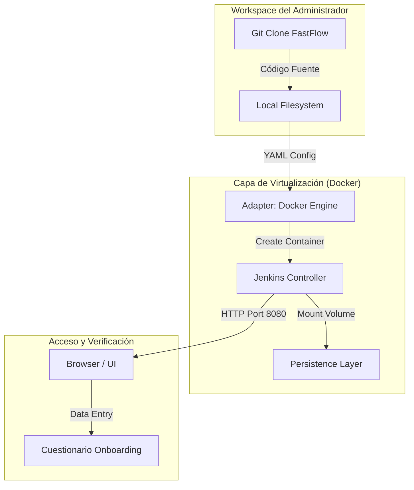
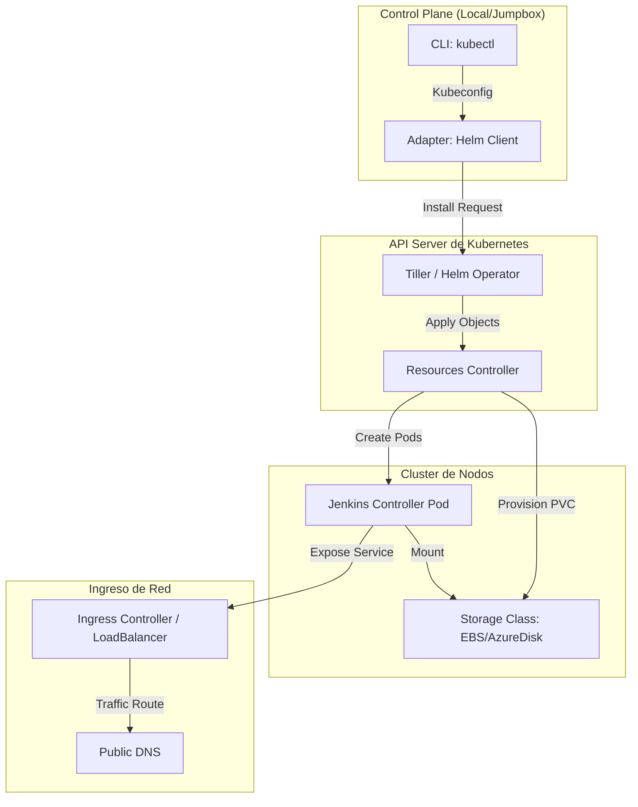
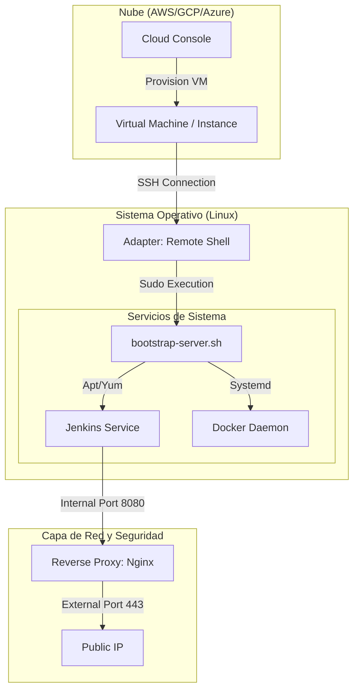

# Guía Maestra de Instalación FastFlow (Por Escenario)

FastFlow está diseñado para ser flexible y adaptarse a cualquier infraestructura. Esta guía detalla cómo instalar y configurar el toolkit en tres escenarios comunes: **Docker (Local/Dev)**, **Kubernetes (Cloud Native)** y **Cloud VMs (Legacy/Enterprise)**.

---

## 🏗️ Escenario 1: Docker (Ideal para Desarrollo Local)
Este escenario es perfecto para pruebas rápidas, demos o entornos de desarrollo aislados.

### Flujo de Instalación (Visualización)


### Pasos de Instalación (Copy-Paste)
```bash
# 1. Clonar el repositorio
git clone <URL_REPO_FASTFLOW> toolkit-fastflow
cd toolkit-fastflow

# 2. Levantar el entorno con Docker Compose
docker-compose up -d

# 3. Obtener contraseña inicial de administrador
docker exec jenkins-fastflow cat /var/jenkins_home/secrets/initialAdminPassword
```

---

## ☁️ Escenario 2: Kubernetes (Entorno Cloud Native)
Recomendado para producción y escalabilidad masiva usando agentes efímeros.

### Flujo de Instalación (Visualización)


### Pasos de Instalación (Copy-Paste)
```bash
# 1. Añadir el repositorio de Helm de FastFlow
helm repo add fastflow https://charts.fastflow.ai
helm repo update

# 2. Instalar con valores personalizados
helm install fastflow-jenkins fastflow/jenkins-chart \
  --set persistence.size=20Gi \
  --set controller.serviceType=LoadBalancer \
  --namespace fastflow-system --create-namespace

# 3. Verificar estado de los Pods
kubectl get pods -n fastflow-system
```

---

## 🖥️ Escenario 3: Cloud VMs / Bare Metal (Legacy Enterprise)
Para organizaciones que requieren control total sobre el sistema operativo y la red.

### Flujo de Instalación (Visualización)


### Pasos de Instalación (Copy-Paste)
```bash
# 1. Ejecutar el script de inicialización de FastFlow
curl -sSL https://raw.fastflow.ai/install.sh | bash

# 2. Alternativa: Usar nuestro instalador local
chmod +x toolkit-fastflow/installers/bootstrap-server.sh
./toolkit-fastflow/installers/bootstrap-server.sh --type enterprise

# 3. Validar entorno
./toolkit-fastflow/installers/check-environment.sh
```

---

## 📊 Comparativa de Escenarios

| Característica | Docker (Local) | Kubernetes (Cloud) | Cloud VMs (Enterprise) |
| :--- | :---: | :---: | :---: |
| **Velocidad de Setup** | ⭐⭐⭐⭐⭐ | ⭐⭐⭐ | ⭐⭐ |
| **Escalabilidad** | ⭐ | ⭐⭐⭐⭐⭐ | ⭐⭐⭐ |
| **Control de Infra** | ⭐⭐ | ⭐⭐⭐ | ⭐⭐⭐⭐⭐ |
| **Mantenibilidad** | ⭐⭐⭐ | ⭐⭐⭐⭐ | ⭐⭐ |

---

*FastFlow: La tubería que se adapta a tu terreno. No importa dónde estés, el software debe fluir.*
