# Guía de Pipeline as Code con Jenkins (Capa 17 de FastFlow)

En la era del cloud, configurar Jenkins haciendo clic en formularios web es cosa del pasado. FastFlow utiliza **Pipeline as Code (PaC)** para asegurar que tu flujo de entrega sea rápido, consistente y auditable.

## 1. ¿Qué es un Jenkinsfile?
Es un archivo de texto que vive en la raíz de tu repositorio y define todo tu flujo de CI/CD. Al ser código:
- **Se versiona**: Sabes quién cambió qué y por qué.
- **Se audita**: Puedes hacer Code Reviews de tu infraestructura.
- **Se recupera**: Si el servidor de Jenkins muere, tu configuración vive en Git.

## 2. Declarativo vs. Scripted
FastFlow recomienda el uso de **Declarative Pipeline** por su sintaxis clara y estructurada.
- **Declarativo**: Más rígido pero más fácil de leer. Ideal para la mayoría de los flujos.
- **Scripted**: Permite el uso completo de Groovy. Útil para lógica extremadamente compleja.

## 3. Estructura Estándar de FastFlow
Un Jenkinsfile de FastFlow típicamente incluye:
- **agent**: Define dónde se ejecutará el flujo (ej: un pod de Kubernetes o un nodo específico).
- **environment**: Variables necesarias para el despliegue.
- **stages**: Las fases del flujo (Checkout, Test, Build, Deploy).
- **post**: Acciones tras finalizar (limpieza, notificaciones a Slack).

### Flujo de Ejecución (Visualización)

```mermaid
graph LR
    subgraph "Entorno del Desarrollador"
        A[IDE / VS Code] -- "Git Commit/Push" --> B[Local Git Repo]
    end

    subgraph "Proveedor de Git (GitHub/GitLab)"
        B -- "SSH/HTTPS" --> C[Remote Repository]
        C -- "Webhook Event" --> D[Adapter: Webhook Gateway]
    end

    subgraph "Infraestructura FastFlow"
        D -- "Trigger Payload" --> E[Jenkins Controller]
        E -- "Load Pipeline" --> F[Jenkinsfile Execution]
        
        subgraph "Agente Efímero (Docker/K8s)"
            F -- "Command Execution" --> G[Build & Test]
            G -- "Unit Test Results" --> H[SAST Analysis]
        end
    end

    subgraph "Destinos y Artefactos"
        H -- "Docker Image" --> I[Container Registry]
        I -- "Pull Image" --> J[Staging Environment]
        J -- "Deployment Status" --> K[Adapter: Slack/Notification]
    end

    K -- "Feedback Loop" --> A
```

## 4. Beneficios del Enfoque FastFlow
1. **Velocidad**: Clonar un pipeline para un nuevo microservicio es cuestión de segundos.
2. **Consistencia**: Todos los proyectos siguen los mismos estándares de calidad y seguridad.
3. **Eficiencia**: Reduce errores humanos al eliminar la configuración manual.

## 5. Visualización: Blue Ocean
FastFlow recomienda el uso del plugin **Blue Ocean** para una visualización moderna e intuitiva de las etapas del pipeline, permitiendo identificar fallos rápidamente sin bucear en miles de líneas de logs.

---
*Tu pipeline es tan importante como tu aplicación. Trátalo como código de primera clase.*
