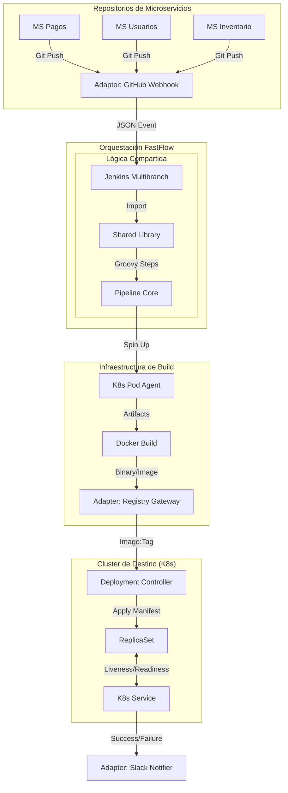

# Guía de Pipeline as Code para Microservicios (Capa 22 de FastFlow)

Gestionar un solo pipeline es fácil; gestionar cientos de microservicios requiere una estrategia de **Multibranch Pipeline** y una automatización total mediante **Webhooks**.

## 1. El Desafío de los Microservicios
En FastFlow, cada servicio es independiente. Esto significa:
- **Repositorios Múltiples**: Cada servicio (ej: Pagos, Usuarios, Inventario) tiene su propio Git y su propio Jenkinsfile.
- **Dueños Claros**: Un equipo puede desplegar su servicio sin esperar a otros.
- **Tecnologías Mixtas**: Un servicio puede ser Go, otro Python y otro Node.js.

## 2. Multibranch Pipeline: Automatización por Rama
FastFlow no crea trabajos manuales. Usamos el plugin Multibranch Pipeline:
- **Descubrimiento Automático**: Jenkins escanea el repositorio y crea un flujo para cada rama (develop, master, feature/*) que contenga un Jenkinsfile.
- **Aislamiento**: Los fallos en una rama de "feature" no afectan a la rama "master".

## 3. Webhooks: El Gatillo en Tiempo Real
No escaneamos Git cada 5 minutos. Usamos Webhooks:
1. **Evento**: Un desarrollador hace `git push`.
2. **Notificación**: GitHub/GitLab envía un mensaje instantáneo a Jenkins.
3. **Acción**: Jenkins arranca el build inmediatamente. **Feedback en segundos.**

### Flujo de Microservicios (Visualización)

## 4. Estrategia de Ramas (GitFlow FastFlow)
- **develop**: Integración continua. Cada push despliega en el entorno de Desarrollo.
- **feature/***: Ramas temporales. Solo ejecutan tests y builds (sin despliegue).
- **master/main**: Código estable. Despliega en Producción tras aprobación.

## 5. Mejores Prácticas
- **Shared Libraries**: No repitas código en tus Jenkinsfiles. Mueve la lógica común (ej: cómo construir una imagen Docker) a una librería compartida de FastFlow.
- **Artifact Registry**: Cada build exitoso genera una imagen única etiquetada con el Git SHA para una trazabilidad total.

---
*La agilidad de los microservicios solo es posible con un pipeline que escale tan rápido como tus servicios.*
