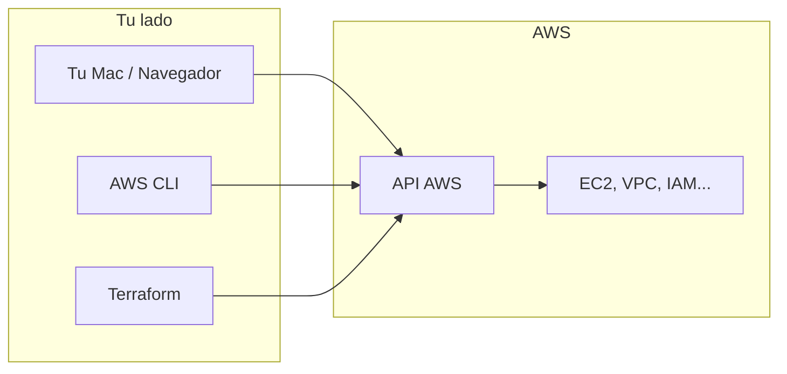
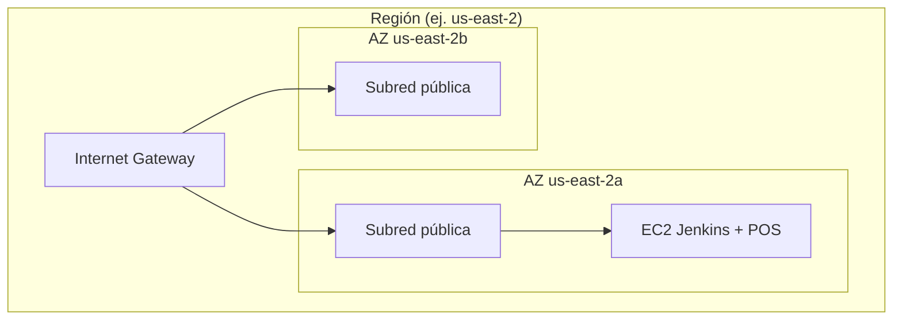
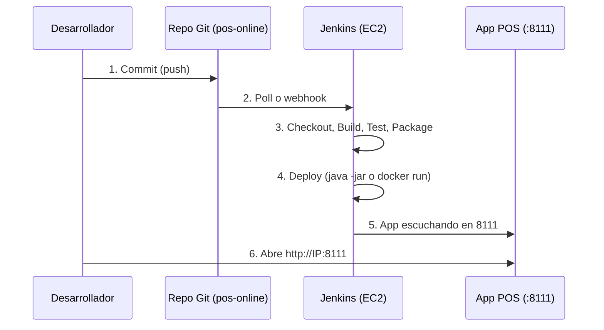
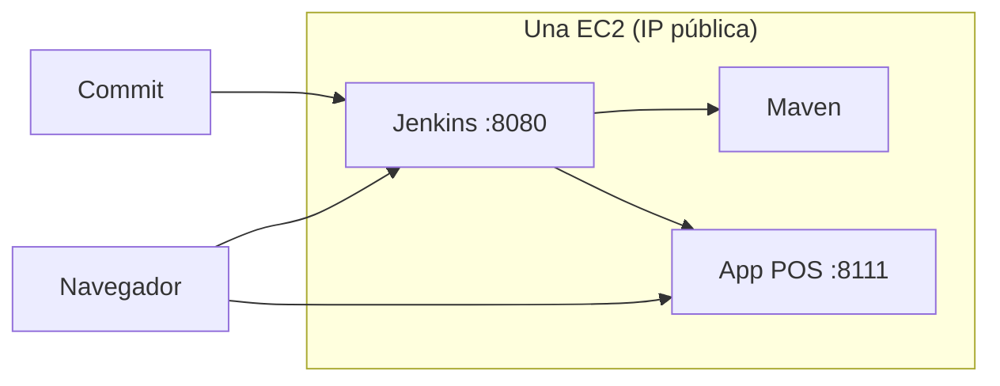
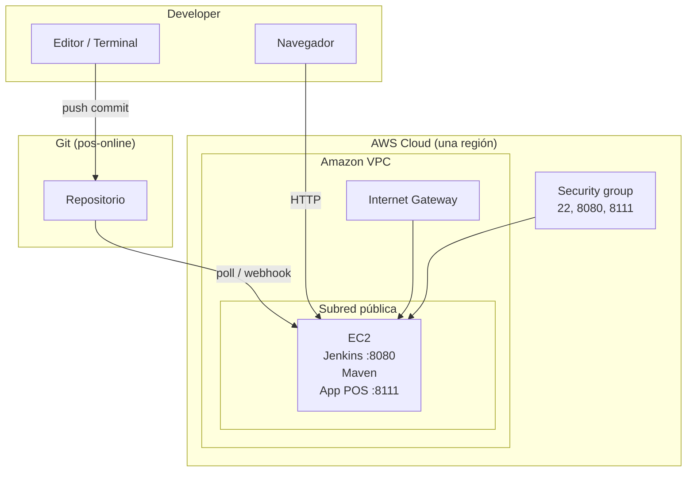

# Capítulo 3 — Desplegar y operar en la infraestructura global de AWS

**Estilo:** Documentación formal con diagramas, alineada a conceptos de AWS (Console, CLI, IaC, Region, AZ, VPC) y al flujo unclic: una instancia, un commit, app POS levantada de nuevo.

---

## Qué cubre este capítulo

- Alojar la pila (Jenkins + POS) en AWS: una EC2, una región, red aislada.
- Formas de interactuar con AWS: Management Console, AWS CLI, Infrastructure as Code (Terraform).
- Uso de la infraestructura global: región, Availability Zones, Amazon VPC.
- Flujo completo: commit → Jenkins → pipeline → app POS de nuevo en marcha (con diagramas).
- Guía paso a paso y referencias a documentación oficial de AWS.

---

## 3.1 Alojar la pila en AWS

**Desplegar** aquí significa poner en marcha los recursos de TI en la nube (red, servidor, aplicaciones). **Operar** es mantenerlos en uso día a día hasta que se apaguen.

Para el objetivo **“una instancia, un commit, app levantada de nuevo”** alojamos en AWS:

- **Una red privada (VPC)** donde viven los recursos.
- **Una instancia EC2** que hace de servidor único: Jenkins + (tras el pipeline) la aplicación POS.
- **Acceso por internet** a esa instancia (IP pública, puertos 22, 8080, 8111) para administrar y usar Jenkins y la app.

La decisión de usar **una sola región y una sola EC2** simplifica el despliegue y encaja con el Free Tier y con la prueba “un commit → todo el flujo → instancia (app) levantada de nuevo”.

---

## 3.2 Desplegar y operar en AWS

### 3.2.1 Formas de interactuar con AWS

Todas las interacciones con AWS pasan por **APIs**. Puedes usar interfaz gráfica, línea de comandos o código (IaC); por debajo son llamadas y respuestas de API.

| Forma | Uso en nuestro flujo | Documentación oficial |
|-------|------------------------|------------------------|
| **AWS Management Console** | Crear cuenta, usuario IAM, ver EC2, Security Groups, conectar a la instancia (EC2 Instance Connect). | [AWS Management Console](https://aws.amazon.com/console/) |
| **AWS CLI** | Configurar identidad (`aws configure`), obtener AMI (`aws ec2 describe-images`), verificar cuenta (`aws sts get-caller-identity`). | [AWS CLI](https://aws.amazon.com/cli/) |
| **Infrastructure as Code (Terraform)** | Definir VPC, subnets, EC2, security groups en código; `terraform apply` crea y actualiza recursos. | [AWS + Terraform](https://registry.terraform.io/providers/hashicorp/aws/latest/docs); en el repo: `manifests/terraform/jenkins-aws/` |

**Figura 3.1** — Tu equipo y la consola hacen llamadas a la API de AWS; AWS devuelve respuestas y aplica cambios (crear EC2, abrir puertos, etc.).

---

### 3.2.2 Modelo de despliegue que usamos

Usamos un despliegue **en la nube (cloud-native)**:

- Toda la infra (VPC, EC2) y las aplicaciones (Jenkins, POS) están en AWS.
- Accedes por internet: consola (aws.amazon.com), navegador (Jenkins en :8080, POS en :8111), EC2 Instance Connect para la terminal.

No usamos híbrido ni on‑premises para este flujo.

---

### 3.2.3 Conectividad

- **Internet público:** Tu Mac y los usuarios acceden a la EC2 por su IP pública (puertos 22, 8080, 8111). El security group controla qué puertos están abiertos.
- **Dentro de la VPC:** La EC2 está en una subred pública; tiene IP pública e internet para descargar paquetes (yum, Maven, etc.).

Para un entorno más restrictivo más adelante se podría usar VPN o Direct Connect; para la prueba “una instancia, un commit” basta con internet y el security group.

---

## 3.3 Uso de la infraestructura global de AWS

### 3.3.1 Región

- Elegimos **una región** (por ejemplo **us-east-2**, Ohio) y toda la infra se crea ahí.
- Las regiones están aisladas entre sí; un fallo en otra región no afecta la tuya.
- Documentación: [Regiones y zonas de disponibilidad](https://docs.aws.amazon.com/AmazonRDS/latest/UserGuide/Concepts.RegionsAndAvailabilityZones.html).

### 3.3.2 Availability Zones (AZ)

- Una región tiene varias **Availability Zones** (datacenters separados, baja latencia entre ellas).
- En nuestro Terraform usamos **dos AZs** para la VPC (p. ej. `us-east-2a`, `us-east-2b`); la EC2 de Jenkins/POS se levanta en una de las subredes públicas (una AZ).
- Para alta disponibilidad se usarían varias AZs; para “una instancia, un commit” una AZ es suficiente.

**Figura 3.2** — Región con dos AZs; la EC2 está en una subred pública de una AZ.

### 3.3.3 Amazon VPC

- **Amazon VPC** es una red privada y aislada dentro de AWS donde creas subnets, rutas y security groups.
- Terraform crea **una VPC** (CIDR 10.0.0.0/16), subredes públicas (y privadas), un **Internet Gateway** y reglas de seguridad.
- Documentación: [Amazon VPC](https://docs.aws.amazon.com/vpc/latest/userguide/what-is-amazon-vpc.html).

---

## 3.4 Flujo completo: de un commit a la app levantada de nuevo

Objetivo: **un commit** recorre todo el flujo hasta que **la aplicación POS vuelve a estar levantada** en la misma EC2.

**Figura 3.3** — Flujo de extremo a extremo.

**Figura 3.4** — Componentes en la única EC2.

---

## 3.5 Guía paso a paso (resumen ordenado)

Los pasos siguientes limpian las “notas para desarrollador” y dejan una única secuencia documentada. La documentación oficial de AWS se usa para Console, CLI y conceptos (VPC, Region, AZ).

### Fase A — Cuenta y acceso a AWS

| Paso | Acción | Dónde | Documentación oficial |
|------|--------|--------|------------------------|
| A.1 | Crear cuenta AWS y usuario IAM (Access Key + Secret). | [IAM Console](https://console.aws.amazon.com/iam/) | [Crear usuario IAM](https://docs.aws.amazon.com/IAM/latest/UserGuide/id_users_create.html) |
| A.2 | Instalar y configurar AWS CLI: `aws configure` (Access Key, Secret, región, ej. `us-east-2`). | Terminal (Mac/Linux) | [Configurar AWS CLI](https://docs.aws.amazon.com/cli/latest/userguide/cli-configure-quickstart.html) |
| A.3 | Verificar identidad: `aws sts get-caller-identity`. | Terminal | [get-caller-identity](https://docs.aws.amazon.com/cli/latest/reference/sts/get-caller-identity.html) |

### Fase B — Infraestructura como código (Terraform)

| Paso | Acción | Dónde | Documentación en repo |
|------|--------|--------|------------------------|
| B.1 | Ir al directorio Terraform: `cd manifests/terraform/jenkins-aws/envs/dev`. | Terminal | README en `jenkins-aws/` |
| B.2 | Crear variables: `cp terraform.tfvars.free-tier.example terraform.tfvars`. Editar: `aws_region`, `availability_zones`, AMI IDs. | Archivo `envs/dev/terraform.tfvars` | INSTRUCCIONES-DEPLOY-AWS-GRATIS.md |
| B.3 | Obtener AMI (Amazon Linux 2): `aws ec2 describe-images --owners amazon --region us-east-2 --filters "Name=name,Values=amzn2-ami-hvm-*-x86_64-gp2" --query 'Images \| sort_by(@, &CreationDate) \| [-1].ImageId' --output text`. | Terminal | Mismo doc |
| B.4 | `terraform init` → `terraform validate` → `terraform plan -var-file=terraform.tfvars` → `terraform apply -var-file=terraform.tfvars`. | Terminal, `envs/dev` | Mismo doc |
| B.5 | Anotar el output `jenkins_public_ip` (y, si aplica, abrir puerto 8111 en el security group). | Outputs de Terraform / AWS Console → EC2 → Security Groups | VERIFICACION-FLUJO-UN-COMMIT-LEVANTA-INSTANCIA.md |

### Fase C — Conectar a la instancia e instalar software

| Paso | Acción | Dónde | Documentación oficial |
|------|--------|--------|------------------------|
| C.1 | Conectar a la EC2: AWS Console → EC2 → Instances → seleccionar la instancia → **Connect** → pestaña **EC2 Instance Connect** → usuario `ec2-user` → **Connect**. | [EC2 Console](https://console.aws.amazon.com/ec2/) | [Conectar a instancia Linux](https://docs.aws.amazon.com/AWSEC2/latest/UserGuide/AccessingInstances.html) |
| C.2 | En la sesión abierta: instalar Java 11 (`sudo yum install -y java-11-amazon-corretto-devel`), Jenkins (repo + `yum install jenkins`), Maven (`sudo yum install -y maven`). Arrancar Jenkins: `sudo systemctl enable jenkins && sudo systemctl start jenkins`. | Terminal en el navegador (EC2 Instance Connect) | [Amazon Corretto](https://docs.aws.amazon.com/corretto/); Jenkins en repo: INSTALAR-JENKINS.md |
| C.3 | Abrir en el navegador `http://<jenkins_public_ip>:8080`; usar la contraseña inicial (`sudo cat /var/lib/jenkins/secrets/initialAdminPassword`). | Navegador | — |
| C.4 | (Opcional) Abrir puerto 8111: EC2 → Security Groups → fastflow-jenkins-sg → Edit inbound rules → Add rule: TCP 8111, 0.0.0.0/0. | AWS Console | [Security groups](https://docs.aws.amazon.com/vpc/latest/userguide/VPC_SecurityGroups.html) |

### Fase D — Configurar el flujo “un commit → app levantada”

| Paso | Acción | Dónde | Documentación en repo |
|------|--------|--------|------------------------|
| D.1 | En Jenkins: crear job **Pipeline** (o Pipeline from SCM); repo = pos-online; Jenkinsfile en la raíz; asegurar generic-model (submódulo o segundo proyecto). | Jenkins UI | JENKINS-PIPELINE-FASTFLOW.md, INSTALAR-JENKINS.md |
| D.2 | Configurar trigger: Poll SCM (ej. cada 2 min) o webhook desde Git. | Jenkins job configuration | — |
| D.3 | En el Jenkinsfile: reemplazar el stage **Deploy** por un paso real: ejecutar `java -jar target/pos-online-*.jar --server.port=8111` (o `docker run` con la imagen construida) en la EC2. | Repo pos-online (Jenkinsfile) | VERIFICACION-FLUJO-UN-COMMIT-LEVANTA-INSTANCIA.md |
| D.4 | Hacer un commit en la rama configurada; comprobar que el job se ejecuta y que `http://<IP>:8111` responde. | Repo + navegador | — |

---

## 3.6 Diagrama de arquitectura (una página)

**Figura 3.5** — Vista de conjunto: desarrollador, AWS, una región, una EC2.

---

## 3.7 Referencias a documentación oficial de AWS

| Tema | Enlace |
|------|--------|
| AWS Management Console | https://aws.amazon.com/console/ |
| AWS CLI (instalación y configuración) | https://aws.amazon.com/cli/ |
| Regiones y Availability Zones | https://docs.aws.amazon.com/AmazonRDS/latest/UserGuide/Concepts.RegionsAndAvailabilityZones.html |
| Amazon VPC | https://docs.aws.amazon.com/vpc/latest/userguide/what-is-amazon-vpc.html |
| Security groups | https://docs.aws.amazon.com/vpc/latest/userguide/VPC_SecurityGroups.html |
| Conectar a instancia Linux | https://docs.aws.amazon.com/AWSEC2/latest/UserGuide/AccessingInstances.html |
| EC2 Instance Connect | https://docs.aws.amazon.com/AWSEC2/latest/UserGuide/ec2-instance-connect-methods.html |
| Qué es un API | https://aws.amazon.com/what-is/api/ |

---

## 3.8 Resumen

- **Alojar la pila en AWS:** una VPC, una EC2 (Jenkins + Maven + app POS), acceso por internet (Console, navegador, EC2 Instance Connect).
- **Interacción con AWS:** Management Console (gráfico), AWS CLI (comandos), Terraform (IaC); todo sobre las APIs de AWS.
- **Infraestructura global:** una región, dos AZs en la VPC, una EC2 en subred pública; VPC aislada y security group (22, 8080, 8111).
- **Flujo “un commit → app levantada”:** commit → Jenkins (poll/webhook) → Build/Test/Package → Deploy (JAR o contenedor) → app en :8111; documentado con diagramas en este capítulo.
- **Guía paso a paso:** Fases A (cuenta/CLI), B (Terraform), C (conectar e instalar), D (job Jenkins y Deploy real); las notas de desarrollador se sustituyen por esta secuencia y por los docs enlazados.

---

## Uso de este documento

- **Para formación:** leer en orden 3.1 → 3.4 y usar las figuras 3.1–3.5.
- **Para ejecutar:** seguir la guía 3.5 (Fases A–D) y los enlaces a documentación oficial.
- **Para verificar el flujo:** usar [VERIFICACION-FLUJO-UN-COMMIT-LEVANTA-INSTANCIA.md](../20-operaciones/VERIFICACION-FLUJO-UN-COMMIT-LEVANTA-INSTANCIA.md) como checklist.
- **Para ver qué servicios AWS usamos:** [Capítulo 4 — Servicios core de AWS](CAPITULO-SERVICIOS-CORE-AWS.md) (EC2, EBS, VPC, Security Groups, Terraform).
- **Para facturación, Free Tier y soporte:** [Capítulo 6 — Facturación y precios](CAPITULO-FACTURACION-Y-PRECIOS.md) (nuestro plan de costes y cómo evitar sorpresas).
