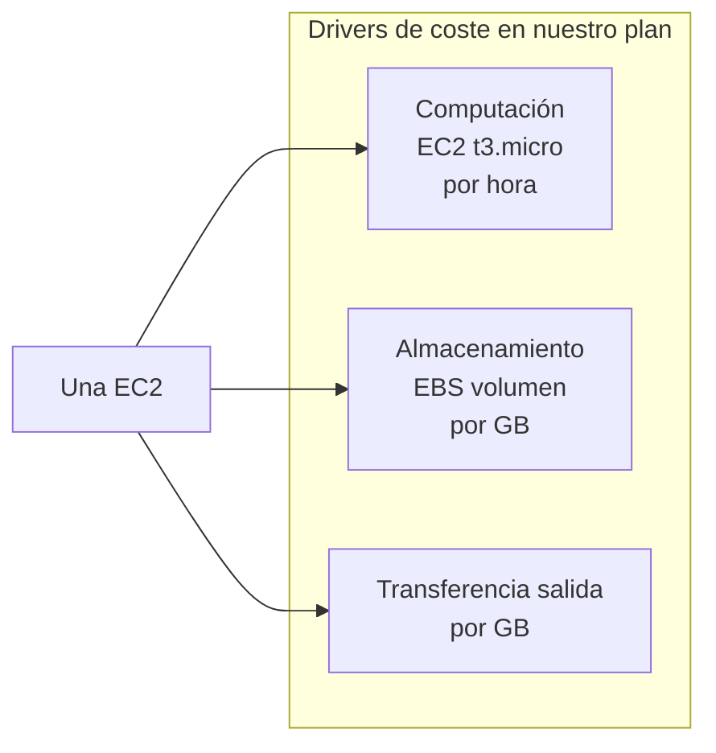
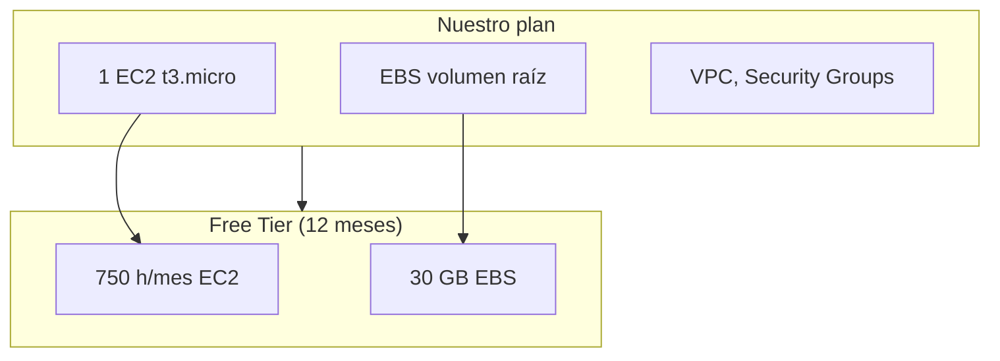
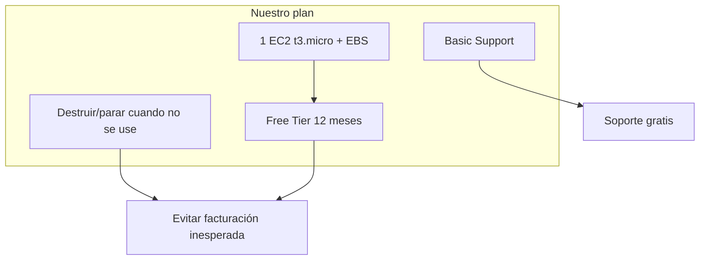

# Capítulo 6 — Facturación y precios en AWS

**Estilo:** Igual que el libro *AWS for Non-Engineers* (cap. 6): conceptos de facturación, modelos de precios, Free Tier, panel de facturación, calculadoras y planes de soporte, aplicados a **nuestro plan** (una EC2, Free Tier, sin sorpresas en la factura).

Este capítulo deja **bien claro** en nuestro plan cómo se factura AWS, qué es el Free Tier, dónde revisar el gasto y qué plan de soporte usamos.

---

## Qué cubre este capítulo

- **Conceptos de facturación:** los tres drivers de coste (computación, almacenamiento, transferencia de datos salida); modelos de precios de AWS.
- **AWS Free Tier:** tipos (pruebas, 12 meses gratis, siempre gratis); **nuestro uso:** una EC2 t3.micro, 750 h/mes durante 12 meses; cómo no pasarnos.
- **AWS Billing Dashboard:** dónde ver gasto, previsión del mes y servicios activos.
- **Herramientas de coste:** AWS Pricing Calculator, AWS Budgets, Cost Explorer; uso en nuestro plan.
- **Planes de soporte AWS:** Basic (gratis) para nuestro caso; tabla resumida y enlaces oficiales.
- **Resumen explícito de nuestro plan:** Free Tier, una instancia, destruir cuando no se use, soporte Basic.

---

## 6.1 Conceptos de facturación y precios

### 6.1.1 Los tres drivers de coste en AWS

AWS factura principalmente por tres conceptos:

| Driver | Qué es | En nuestro flujo (una EC2) |
|--------|--------|-----------------------------|
| **Computación** | Uso de instancias EC2 (horas, tipo de instancia). | **Sí:** una instancia t3.micro; facturación por horas que esté encendida. |
| **Almacenamiento** | Volúmenes EBS, S3, etc. | **Sí:** el volumen EBS asociado a la EC2 (GB y tipo). |
| **Transferencia de datos salida** | Datos que salen de AWS hacia internet (entrada suele ser gratis). | **Sí:** si descargas mucho o la app sirve tráfico externo; en prueba suele ser bajo. |

**Figura 6.1** — Los tres drivers de coste aplicados a nuestra arquitectura (una EC2).

Documentación: [Cómo funciona la facturación en AWS](https://docs.aws.amazon.com/awsaccountbilling/latest/aboutv2/consume-billing.html) (resumen oficial).

### 6.1.2 Modelos de precios de AWS

| Modelo | Descripción | ¿Lo usamos? |
|--------|-------------|-------------|
| **Pay as you go (on-demand)** | Pagas solo por lo que usas, sin compromiso. | **Sí** — Nuestra EC2 se factura a precio on-demand; el Free Tier cubre un tope de horas/mes. |
| **Save when you commit (reserved instances / savings plans)** | Descuento a cambio de compromiso 1–3 años. | No; no tenemos compromiso. |
| **Spot instances** | Uso de capacidad sobrante; hasta ~90 % más barato; la instancia puede ser reclamada por AWS. | No; queremos una instancia estable para Jenkins. |
| **Pay less by using more** | Descuentos por volumen en algunos servicios (p. ej. S3). | No aplica a nuestro tamaño de uso. |

**En nuestro plan:** usamos **on-demand** dentro del **Free Tier** (límites de 750 h/mes para EC2 t2.micro/t3.micro en los primeros 12 meses). Si te pasas del Free Tier, se factura al precio on-demand normal.

---

## 6.2 AWS Free Tier

### 6.2.1 Tipos de ofertas del Free Tier

El Free Tier incluye tres tipos de ofertas (según el servicio):

| Tipo | Descripción | Ejemplo |
|------|-------------|---------|
| **Pruebas (trials)** | Uso gratis durante un tiempo; después se cobra al precio estándar. | Algunos servicios 30 días gratis. |
| **12 meses gratis** | Uso limitado gratis durante 12 meses desde la creación de la cuenta. | **EC2:** 750 horas/mes de t2.micro (o t3.micro según región) durante 12 meses. |
| **Siempre gratis** | Límites permanentes sin caducidad. | Ej. 1 millón de solicitudes/mes en Lambda. |

**Importante:** No todos los servicios tienen Free Tier. Antes de usar un servicio nuevo, conviene comprobar en la página oficial del Free Tier.

Documentación oficial: [AWS Free Tier](https://aws.amazon.com/free/).

### 6.2.2 Free Tier aplicado a nuestro plan

**Nuestro plan queda así:**

| Recurso | Uso en nuestro flujo | Free Tier (12 meses) | Riesgo de sobrecoste |
|---------|----------------------|------------------------|----------------------|
| **EC2** | Una instancia t3.micro (Jenkins + POS). | 750 horas/mes de t2.micro o t3.micro (según región). Una instancia 24×7 ≈ 720 h/mes, por tanto **dentro del Free Tier**. | Si dejas la instancia encendida todo el mes y superas 750 h, o usas un tipo mayor (p. ej. t3.small), se factura el exceso. |
| **EBS** | Un volumen asociado a la EC2 (Amazon Linux 2). | 30 GB de almacenamiento EBS tipo General Purpose (SSD) o Magnético. | Si el volumen supera 30 GB o usas tipos más caros, se factura el exceso. |
| **Transferencia** | Entrada a AWS suele ser gratis; salida (tráfico que sirve la app/Jenkins) tiene un límite gratis al mes (p. ej. 15 GB en muchas regiones). | Consultar [Free Tier](https://aws.amazon.com/free/) por región. | Uso normal de prueba suele quedar dentro. |

**Regla clara para nuestro plan:**  
- **Una sola EC2 t3.micro**, encendida solo cuando la uses.  
- **Apagarla o destruirla** cuando no la necesites: `terraform destroy` o Stop Instance en la consola, para no consumir horas de más y evitar facturación inesperada.

**Figura 6.2** — Nuestro plan en relación con el Free Tier.

---

## 6.3 AWS Billing Dashboard

El **AWS Billing Dashboard** es la página principal de la consola de facturación. Ahí ves:

- **Resumen del mes:** previsión de gasto, saldo del mes, tendencias.
- **Servicios con más coste:** qué está generando facturación.
- **Cuentas activas** (si usas organizaciones).

**Para nuestro plan:** revisar de vez en cuando que solo aparezcan la EC2 y el EBS que esperas, y que la previsión del mes siga siendo baja o 0 si estás dentro del Free Tier.

Acceso (tras iniciar sesión): [AWS Billing Console](https://console.aws.amazon.com/billing/).  
Documentación: [Visión general del panel de facturación](https://docs.aws.amazon.com/awsaccountbilling/latest/aboutv2/consolidated-billing.html) y la ayuda en consola.

---

## 6.4 Herramientas de coste y presupuesto

| Herramienta | Para qué sirve | Uso en nuestro plan |
|-------------|----------------|----------------------|
| **AWS Pricing Calculator** | Estimar coste mensual según servicios y uso que introduzcas. | Calcular a mano: 1 EC2 t3.micro + EBS pequeño; comprobar que encaja en Free Tier o en un presupuesto bajo. |
| **AWS Budgets** | Definir presupuestos (p. ej. 5 €/mes) y recibir alertas si el gasto real o previsto se acerca o supera el umbral. | **Recomendado:** crear un presupuesto bajo (ej. 10 USD/mes) y alerta al 80 % para evitar sorpresas. |
| **AWS Cost Explorer** | Analizar gasto pasado y tendencias; ver proyecciones. | Revisar cada cierto tiempo qué servicios han generado coste. |

- **AWS Pricing Calculator:** [https://calculator.aws/](https://calculator.aws/)  
- **AWS Budgets:** [https://docs.aws.amazon.com/cost-management/latest/userguide/budgets-managing-costs.html](https://docs.aws.amazon.com/cost-management/latest/userguide/budgets-managing-costs.html)  
- **Cost Explorer:** desde Billing Console → Cost Explorer.

---

## 6.5 Planes de soporte AWS

AWS tiene varios planes de soporte; el coste y el nivel de asistencia suben con el plan.

### 6.5.1 Resumen de planes (tabla)

| Plan | Coste | Para quién | ¿Nuestro plan? |
|------|--------|------------|-----------------|
| **Basic** | Gratis | Pruebas, experimentación, aprendizaje; cuentas y facturación; documentación y foros. | **Sí** — Es el que usamos: cuenta nueva, Free Tier, una EC2 de prueba. |
| **Developer** | Mín. 29 USD/mes (o 3 % del gasto AWS) | Desarrollo y pruebas con soporte técnico por correo; tiempos de respuesta 12–24 h. | No necesario para “una instancia, un commit”. |
| **Business** | Mín. 100 USD/mes (o % del gasto) | Cargas de trabajo en producción; soporte 24/7; respuesta más rápida. | No para este plan. |
| **Enterprise On-Ramp** | Mín. 5 500 USD/mes | Cargas críticas; TAM, orientación arquitectónica. | No. |
| **Enterprise** | Mín. 15 000 USD/mes | Cargas misión crítica; TAM dedicado, respuesta &lt;15 min. | No. |

Documentación oficial: [Planes de soporte AWS](https://aws.amazon.com/premiumsupport/plans/), [Precios de soporte](https://aws.amazon.com/premiumsupport/pricing/).

### 6.5.2 Qué incluye el Basic Support Plan (nuestro plan)

- Soporte para **cuenta y facturación** (consultas, disputas).
- **Foros** (p. ej. [AWS re:Post](https://repost.aws/)).
- **Documentación**, guías y mejores prácticas.
- **AWS Trusted Advisor:** conjunto básico de comprobaciones (coste, seguridad, cuotas, etc.).
- **AWS Personal Health Dashboard:** estado de los servicios que usas.

**No incluye:** tickets de soporte técnico con respuesta garantizada (eso es desde Developer). Para nuestro objetivo (una EC2, Jenkins, un commit, Free Tier) el plan **Basic** es el adecuado y **gratis**.

---

## 6.6 Resumen: nuestro plan de facturación y precios (dejado claro)

**Lo que dejamos explícito en nuestro plan:**

1. **Modelo de precios:** Pay as you go (on-demand), acotado por el **Free Tier** en los primeros 12 meses.
2. **Recursos que generan coste:** una **EC2 t3.micro** (computación) y su **volumen EBS** (almacenamiento); transferencia de datos salida si hay tráfico.
3. **Free Tier:** 750 h/mes EC2 (t2.micro/t3.micro) y 30 GB EBS; una instancia 24×7 ≈ 720 h, por tanto dentro del Free Tier si no añadimos más instancias ni tipos mayores.
4. **Evitar sorpresas:**  
   - Usar **una sola** instancia del tipo indicado.  
   - **Destruir o parar** la EC2 cuando no se use (`terraform destroy` o Stop en consola).  
   - Revisar el **Billing Dashboard** y, si quieres, crear un **AWS Budget** con alerta (ej. 10 USD/mes, aviso al 80 %).
5. **Soporte:** plan **Basic** (gratis); suficiente para pruebas y aprendizaje con este flujo.
6. **Herramientas útiles:** [AWS Free Tier](https://aws.amazon.com/free/), [Billing Console](https://console.aws.amazon.com/billing/), [Pricing Calculator](https://calculator.aws/), AWS Budgets.

**Figura 6.3** — Resumen visual del plan de facturación.

---

## 6.7 Referencias oficiales

| Tema | Enlace |
|------|--------|
| AWS Free Tier | https://aws.amazon.com/free/ |
| Cómo funciona la facturación | https://docs.aws.amazon.com/awsaccountbilling/latest/aboutv2/consume-billing.html |
| AWS Billing Console | https://console.aws.amazon.com/billing/ |
| AWS Pricing Calculator | https://calculator.aws/ |
| Precios EC2 | https://aws.amazon.com/ec2/pricing/ |
| Planes de soporte | https://aws.amazon.com/premiumsupport/plans/ |
| Precios de soporte | https://aws.amazon.com/premiumsupport/pricing/ |
| AWS Budgets | https://docs.aws.amazon.com/cost-management/latest/userguide/budgets-managing-costs.html |

---

## Cuestionario del capítulo (estilo libro)

**6.1** ¿Cuáles son los tres drivers principales de coste en AWS?  
→ Computación, almacenamiento y transferencia de datos salida.

**6.2** ¿Qué modelo de precios usamos para la EC2 en este plan?  
→ Pay as you go (on-demand), dentro de los límites del Free Tier.

**6.3** ¿Qué plan de soporte es adecuado para nuestro caso (una EC2, Free Tier, pruebas)?  
→ Basic Support Plan (gratis).

**6.4** ¿Qué hacer para evitar facturación inesperada con nuestra única EC2?  
→ Destruir o parar la instancia cuando no se use (`terraform destroy` o Stop en consola) y, opcionalmente, crear un AWS Budget con alerta.

---

**Relación con otros capítulos:** El [Capítulo 3](CAPITULO-DESPLIEGUE-OPERACION-AWS.md) describe el despliegue y la operación; el [Capítulo 4](CAPITULO-SERVICIOS-CORE-AWS.md) los servicios que usamos. Este capítulo 6 deja **explícito en el plan** la facturación, el Free Tier y el soporte para que no haya dudas sobre costes ni nivel de soporte.
