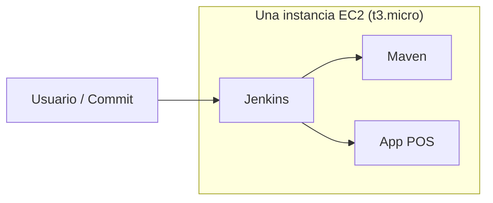
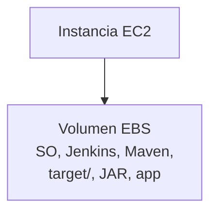
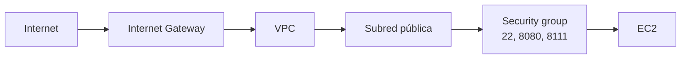
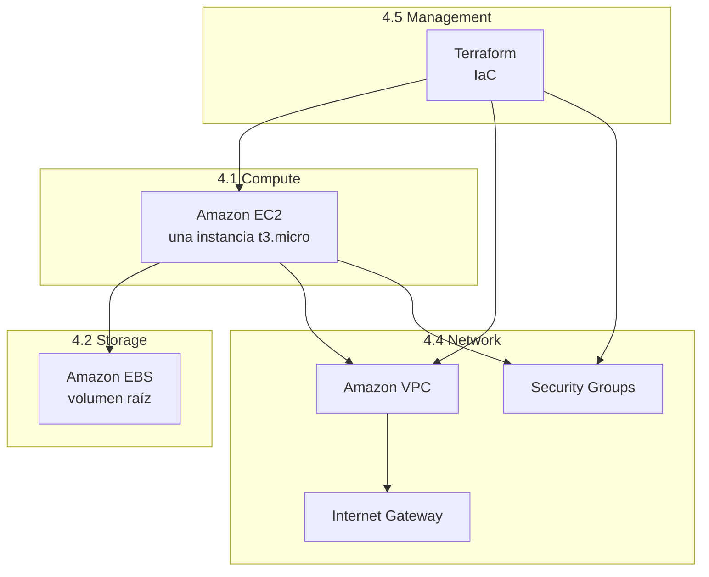

# Capítulo 4 — Servicios core de AWS

**Estilo:** Igual que el libro *AWS for Non-Engineers* (cap. 4): servicios de computación, almacenamiento, bases de datos, red y herramientas de gestión, aplicados a nuestro flujo (una EC2, Jenkins, POS, un commit).

En el capítulo 3 vimos cómo alojar la pila en AWS, las formas de interactuar (Console, CLI, IaC) y el flujo commit → app levantada. Aquí identificamos **qué servicios core de AWS usamos** y cómo encajan en ese flujo.

---

## Qué cubre este capítulo

- Servicios de **computación**: Amazon EC2 (instancias, AMI, tipos); qué usamos y qué no (Lambda, ECS, ELB).
- Servicios de **almacenamiento**: Amazon EBS (volumen de la EC2); S3 opcional.
- **Bases de datos**: por qué en este flujo no usamos RDS/DynamoDB (POS con H2 en memoria).
- **Red y entrega de contenido**: Amazon VPC, Security Groups, Internet Gateway; Route 53 opcional.
- **Herramientas de gestión**: IaC con Terraform (y mención de CloudFormation); CloudWatch, CloudTrail, Config, Trusted Advisor como referencia.
- Diagramas y enlaces a documentación oficial de AWS.

---

## 4.1 Servicios de computación

Los servicios de **computación** en AWS ofrecen capacidad de cómputo en la nube: máquinas virtuales, contenedores o código sin servidor. En nuestro flujo usamos **solo instancias (máquinas virtuales)**.

Categorías típicas en AWS:

| Categoría | Ejemplos AWS | ¿Lo usamos en “una instancia, un commit”? |
|-----------|--------------|------------------------------------------|
| **Instancias (máquinas virtuales)** | Amazon EC2, Amazon Lightsail | **Sí — EC2** (una instancia t3.micro). |
| **Contenedores** | Amazon ECS, AWS Fargate | No; la app puede correr como JAR o en un contenedor en la misma EC2. |
| **Serverless** | AWS Lambda | No. |
| **Balanceo y capacidad** | Elastic Load Balancing (ELB), Elastic Beanstalk | No; una sola EC2 sin load balancer. |

### 4.1.1 Amazon Elastic Compute Cloud (Amazon EC2)

**Amazon EC2** es el servicio de máquinas virtuales escalables en AWS. Cada máquina que creas se llama **instancia**. Puedes elegir tipo de instancia (CPU, memoria, almacenamiento), sistema operativo y red.

- **Facturación:** Por horas de uso, tamaño de instancia, región y sistema operativo. En Free Tier, 750 horas/mes de t2.micro (o t3.micro según región) durante 12 meses.
- **AMI (Amazon Machine Image):** Plantilla que incluye sistema operativo y, opcionalmente, software. Nosotros usamos una **AMI de Amazon Linux 2**; Jenkins y la app POS se instalan después (o vía pipeline).
- **Escalado:** EC2 permite auto scaling (aumentar/disminuir instancias). En nuestro caso usamos **una instancia fija** para simplificar y mantener el Free Tier.

**Figura 4.1** — En nuestro flujo, una sola instancia EC2 alberga Jenkins, Maven y la app POS.

Documentación oficial: [Amazon EC2](https://aws.amazon.com/ec2/), [Tipos de instancia](https://aws.amazon.com/ec2/instance-types/), [AMIs](https://docs.aws.amazon.com/AWSEC2/latest/UserGuide/AMIs.html).

### 4.1.2 Otros servicios de computación (no usados en este flujo)

- **AWS Elastic Beanstalk:** Despliega aplicaciones subiendo código; gestiona EC2, balanceo y escalado. Nosotros usamos **Terraform + Jenkins** para tener control explícito del pipeline.
- **Elastic Load Balancing (ELB):** Reparte tráfico entre varias instancias. Con **una sola EC2** no lo necesitamos.
- **AWS Lambda:** Ejecuta código sin gestionar servidores (event-driven). No lo usamos en el flujo “commit → Jenkins → Deploy en EC2”.
- **Amazon ECS:** Orquestación de contenedores. Opcional más adelante; aquí la app puede ser JAR o un contenedor en la misma EC2.

---

## 4.2 Servicios de almacenamiento

AWS ofrece almacenamiento **objeto** (S3), **archivos** (EFS) y **bloques** (EBS). En nuestro flujo solo interviene el almacenamiento **asociado a la EC2**.

| Tipo | Servicio AWS típico | Uso en nuestro flujo |
|------|----------------------|----------------------|
| **Bloque** | Amazon EBS | **Sí** — El volumen raíz de la instancia EC2 es EBS; ahí está el SO, Jenkins, Maven, el JAR y el workspace. |
| **Objeto** | Amazon S3 | Opcional (artefactos, backups, logs); no obligatorio para “un commit → app levantada”. |
| **Archivos** | Amazon EFS | No. |

### 4.2.1 Amazon Elastic Block Store (Amazon EBS)

**Amazon EBS** proporciona volúmenes de almacenamiento a nivel de bloque para usar con instancias EC2. Es el equivalente a un disco duro conectado a la máquina virtual.

- Cada instancia EC2 tiene al menos un **volumen EBS** (raíz); en nuestra AMI es el disco donde se instalan Java, Jenkins, Maven y donde el pipeline genera el JAR y ejecuta la app.
- Los volúmenes persisten aunque la instancia se detenga (según configuración); si destruyes la instancia con Terraform y no conservas el volumen, los datos se pierden.

**Figura 4.2** — La EC2 usa un volumen EBS para SO, aplicaciones y datos del pipeline.

Documentación oficial: [Amazon EBS](https://aws.amazon.com/ebs/), [Tipos de volumen EBS](https://docs.aws.amazon.com/AWSEC2/latest/UserGuide/ebs-volume-types.html).

### 4.2.2 Amazon S3 (opcional)

**Amazon S3** es almacenamiento por **objetos** (archivos en “buckets”). No lo usamos de forma obligatoria en el flujo mínimo; podría servir para guardar artefactos del pipeline, backups o logs. Documentación: [Amazon S3](https://aws.amazon.com/s3/).

---

## 4.3 Servicios de base de datos

AWS ofrece bases de datos relacionales (RDS, Aurora), NoSQL (DynamoDB), almacenamiento analítico (Redshift), etc. En el flujo **“una instancia, un commit”** no usamos bases de datos gestionadas por AWS.

- La aplicación **POS** puede usar una base en memoria (por ejemplo **H2**) en la misma EC2, sin RDS ni DynamoDB.
- Si más adelante se requiere alta disponibilidad o bases gestionadas, se pueden añadir **Amazon RDS** o **Amazon Aurora** (relacional) o **DynamoDB** (NoSQL).

Para este capítulo basta con saber que **no usamos servicios de base de datos gestionados** en el flujo actual. Referencia: [Amazon RDS](https://aws.amazon.com/rds/), [Amazon DynamoDB](https://aws.amazon.com/dynamodb/).

---

## 4.4 Red y entrega de contenido

La red en AWS permite aislar recursos, controlar tráfico y conectar con internet. En nuestro flujo usamos **VPC, subredes, Internet Gateway y Security Groups**. No usamos Route 53, CloudFront ni Global Accelerator para el caso mínimo.

### 4.4.1 Amazon Virtual Private Cloud (Amazon VPC)

**Amazon VPC** es una red privada y aislada dentro de AWS donde defines subredes, tablas de rutas y reglas de firewall.

- Terraform crea **una VPC** (por ejemplo CIDR 10.0.0.0/16) y **subredes públicas** (y privadas) en dos Availability Zones.
- La instancia EC2 está en una **subred pública** con IP pública para acceder por SSH (o EC2 Instance Connect), Jenkins (:8080) y app POS (:8111).

Documentación: [Amazon VPC](https://docs.aws.amazon.com/vpc/latest/userguide/what-is-amazon-vpc.html).

### 4.4.2 Security Groups

Los **Security Groups** actúan como firewall a nivel de instancia: permiten o deniegan tráfico por puerto y origen/destino.

- Nuestra EC2 usa un security group que permite:
  - **Entrada (ingress):** TCP 22 (SSH), 8080 (Jenkins), 8111 (app POS) desde 0.0.0.0/0 (o restringir por IP si se desea).
  - **Salida (egress):** todo (para que la instancia pueda descargar paquetes, clonar repos, etc.).

**Figura 4.3** — VPC, subred pública, Internet Gateway y Security Group en nuestro flujo.

Documentación: [Security groups para VPC](https://docs.aws.amazon.com/vpc/latest/userguide/VPC_SecurityGroups.html).

### 4.4.3 Internet Gateway

El **Internet Gateway** permite que las subredes públicas en la VPC se comuniquen con internet (y que internet llegue a la EC2 por su IP pública). Terraform lo crea y lo asocia a la VPC. Documentación: [Internet Gateway](https://docs.aws.amazon.com/vpc/latest/userguide/VPC_Internet_Gateway.html).

### 4.4.4 Amazon Route 53 (opcional)

**Route 53** es el servicio DNS de AWS: traduce nombres de dominio (ej. `mi-app.ejemplo.com`) a direcciones IP. En el flujo mínimo accedemos por **IP pública** (ej. `http://3.15.4.160:8080`); no es obligatorio usar Route 53 hasta que quieras un nombre de dominio. Documentación: [Amazon Route 53](https://aws.amazon.com/route53/).

---

## 4.5 Herramientas de gestión

Las herramientas de gestión permiten aprovisionar, supervisar y automatizar la infraestructura en AWS.

| Herramienta AWS | Descripción breve | Uso en nuestro flujo |
|-----------------|-------------------|----------------------|
| **Infrastructure as Code** | Definir infraestructura en código (plantillas o scripts). | **Terraform** (no CloudFormation): definimos VPC, EC2, security groups en `.tf` y aplicamos con `terraform apply`. |
| **AWS CloudFormation** | IaC nativo de AWS (plantillas YAML/JSON). | No lo usamos; usamos Terraform. |
| **AWS CloudTrail** | Registro de actividad y llamadas API en la cuenta. | Útil para auditoría; no obligatorio para el flujo mínimo. |
| **Amazon CloudWatch** | Métricas, logs y alarmas de recursos AWS. | Opcional para vigilar la EC2 y Jenkins. |
| **AWS Config** | Evaluar configuraciones de recursos frente a reglas. | Opcional. |
| **AWS Trusted Advisor** | Recomendaciones de coste, rendimiento, seguridad, tolerancia a fallos. | Útil para revisar la cuenta; no obligatorio para el flujo. |

### 4.5.1 Infrastructure as Code (Terraform)

Nosotros usamos **Terraform** (HashiCorp) como IaC para AWS: los archivos en `manifests/terraform/jenkins-aws/` describen la VPC, subredes, security group e instancia EC2. Al ejecutar `terraform apply`, se crean o actualizan esos recursos.

- **Ventaja:** Misma infraestructura reproducible; cambios versionados; no dependemos de la consola para crear la red y la EC2.
- **Documentación Terraform + AWS:** [Provider AWS para Terraform](https://registry.terraform.io/providers/hashicorp/aws/latest/docs). AWS también ofrece **AWS CloudFormation** para IaC con plantillas propias: [AWS CloudFormation](https://aws.amazon.com/cloudformation/).

### 4.5.2 Amazon CloudWatch (opcional)

**CloudWatch** recopila métricas y logs de recursos (por ejemplo EC2) y permite crear alarmas. Puedes usarlo para vigilar CPU, disco o logs de Jenkins cuando quieras operar la instancia con más visibilidad. Documentación: [Amazon CloudWatch](https://aws.amazon.com/cloudwatch/).

### 4.5.3 AWS Trusted Advisor (opcional)

**Trusted Advisor** revisa la cuenta y sugiere mejoras en coste, rendimiento, seguridad, tolerancia a fallos y cuotas. Útil para revisar buenas prácticas; no es un requisito del flujo. Documentación: [AWS Trusted Advisor](https://aws.amazon.com/premiumsupport/technology/trusted-advisor/).

---

## 4.6 Resumen: servicios que usamos en una sola EC2

**Figura 4.4** — Mapa de servicios core de AWS que intervienen en nuestro flujo.

| Área | Servicio | Rol en el flujo |
|------|----------|------------------|
| Compute | **Amazon EC2** | Una instancia (Jenkins + Maven + app POS). |
| Storage | **Amazon EBS** | Volumen raíz de la EC2 (SO, apps, workspace). |
| Database | — | No usamos RDS/DynamoDB; app con H2 en memoria en la EC2. |
| Network | **VPC, Security Groups, Internet Gateway** | Red aislada, firewall (22, 8080, 8111), salida a internet. |
| Management | **Terraform (IaC)** | Crear y actualizar VPC, EC2 y security groups. |

---

## 4.7 Referencias a documentación oficial

| Tema | Enlace |
|------|--------|
| Amazon EC2 | https://aws.amazon.com/ec2/ |
| Tipos de instancia | https://aws.amazon.com/ec2/instance-types/ |
| AMIs | https://docs.aws.amazon.com/AWSEC2/latest/UserGuide/AMIs.html |
| Amazon EBS | https://aws.amazon.com/ebs/ |
| Amazon VPC | https://docs.aws.amazon.com/vpc/latest/userguide/what-is-amazon-vpc.html |
| Security groups | https://docs.aws.amazon.com/vpc/latest/userguide/VPC_SecurityGroups.html |
| Internet Gateway | https://docs.aws.amazon.com/vpc/latest/userguide/VPC_Internet_Gateway.html |
| Terraform AWS Provider | https://registry.terraform.io/providers/hashicorp/aws/latest/docs |
| AWS CloudFormation | https://aws.amazon.com/cloudformation/ |
| Amazon CloudWatch | https://aws.amazon.com/cloudwatch/ |
| AWS Trusted Advisor | https://aws.amazon.com/premiumsupport/technology/trusted-advisor/ |

---

## 4.8 Resumen del capítulo

- **Computación:** Usamos **Amazon EC2** (una instancia). No usamos Lambda, ECS, ELB ni Elastic Beanstalk en el flujo mínimo.
- **Almacenamiento:** Usamos **Amazon EBS** (volumen de la EC2). S3 es opcional.
- **Bases de datos:** No usamos servicios gestionados; la app puede usar base en memoria en la EC2.
- **Red:** Usamos **Amazon VPC**, **Security Groups** e **Internet Gateway**. Route 53 es opcional para dominio.
- **Gestión:** Usamos **Terraform** como IaC. CloudWatch, CloudTrail, Config y Trusted Advisor son opcionales para operar y revisar la cuenta.

---

## Cuestionario del capítulo (estilo libro)

**4.1** ¿Qué servicio de computación usamos para alojar Jenkins y la app POS en nuestro flujo?  
→ **Amazon EC2** (una instancia).

**4.2** ¿Qué tipo de almacenamiento está asociado a la instancia EC2 (disco raíz)?  
→ **Amazon EBS** (almacenamiento en bloques).

**4.3** ¿Qué recurso de red actúa como firewall a nivel de instancia (puertos 22, 8080, 8111)?  
→ **Security Groups**.

**4.4** ¿Con qué herramienta definimos la infraestructura (VPC, EC2, security groups) como código en este proyecto?  
→ **Terraform** (Infrastructure as Code).

---

**Relación con otros capítulos:** El [Capítulo 3](CAPITULO-DESPLIEGUE-OPERACION-AWS.md) describe el despliegue y la operación (Console, CLI, Terraform, flujo commit → app). Este capítulo 4 concreta **qué servicios core de AWS** intervienen en ese flujo y cuáles no usamos para el caso “una instancia, un commit”.
