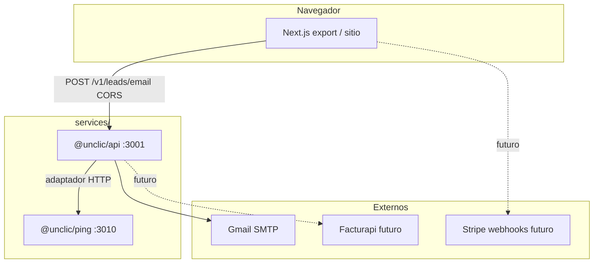
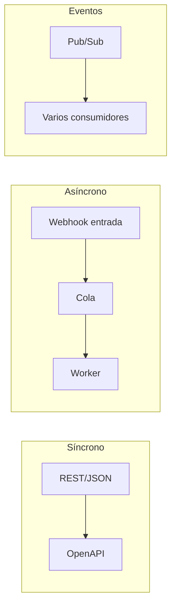

# Módulos, microservicios, adaptadores y OSS (sin reinventar la rueda)

Guía para pensar **UnClic** como **varios módulos desplegables** que hablan por **adaptadores** explícitos. Incluye **software open source** que ya resuelve capas enteras (no hace falta crearlo).

---

## 1. Vocabulario

| Término | Significado en este repo |
|---------|-------------------------|
| **Módulo** | Unidad de negocio o técnica con frontera clara (leads, facturación, catálogo…). Puede vivir en un **monolito** o en un **microservicio**. |
| **Microservicio** | Proceso **independiente** (su propio `package.json`, imagen Docker, ciclo de vida). Ej.: `@unclic/api`, `@unclic/ping`. |
| **Adaptador** | Código que **traduce** entre tu dominio y el mundo exterior (HTTP a otro servicio, cola, webhook, SMTP). Ej.: `services/api/src/adapters/ping-adapter.ts`. |
| **Puerto (hexagonal)** | Interfaz que tu dominio define; el adaptador la implementa (p. ej. `fetchPingHealth`). |
| **BFF / API gateway** | Punto de entrada que agrega llamadas (nuestro `GET /v1/orchestration/health` es un **agregado de salud**, no un gateway completo). |

---

## 2. Diagrama: módulos actuales en el repositorio



---

## 3. Tipos de comunicación entre módulos (elige por caso)



| Patrón | Cuándo usarlo | En UnClic hoy |
|--------|----------------|---------------|
| **HTTP REST** | Request/response, latencia baja, acoplamiento explícito | API ↔ ping; front ↔ API |
| **Webhook** | El proveedor (Stripe, GitHub) te empuja eventos | Pendiente (Stripe) |
| **Cola** | Desacoplar picos, reintentos, trabajo largo | Pendiente |
| **Event bus** | Muchos suscriptores, auditoría | Pendiente |

**Regla:** mismo contrato documentado (OpenAPI o esquema JSON) entre servicios que tú controlas.

---

## 4. Open source que **ya** cubre capas (documentación oficial)

No necesitas construir un “bus propio” el día uno: evalúa estos proyectos y **encaja** adaptadores hacia ellos.

| Capa / necesidad | Proyectos OSS (enlaces oficiales) |
|------------------|-----------------------------------|
| **Abstracción multi-transporte** (HTTP, colas, estado) | [Dapr](https://docs.dapr.io/) |
| **Mensajería ligera** | [NATS](https://docs.nats.io/), [RabbitMQ](https://www.rabbitmq.com/documentation.html), [LavinMQ](https://docs.lavinmq.com/) (AMQP + streams; a veces difundido vía comunidad Crystal / hack weeks OSS) |
| **Streaming / eventos** | [Apache Kafka](https://kafka.apache.org/documentation/) |
| **Workflows duraderos** | [Temporal](https://docs.temporal.io/) |
| **API Gateway / proxy** | [Traefik](https://doc.traefik.io/), [Caddy](https://caddyserver.com/docs/), [Envoy](https://www.envoyproxy.io/docs/envoy/latest/) |
| **Service mesh (avanzado)** | [Istio](https://istio.io/latest/docs/), [Linkerd](https://linkerd.io/2.14/overview/) |
| **Chat / equipos (Slack-like)** | [Mattermost](https://docs.mattermost.com/) — [repo](https://github.com/mattermost/mattermost) |
| **Identidad** | [Keycloak](https://www.keycloak.org/documentation) |
| **Observabilidad** | [OpenTelemetry](https://opentelemetry.io/docs/), [Prometheus](https://prometheus.io/docs/), [Grafana](https://grafana.com/docs/) |
| **ERP / back office** | [ERPNext](https://docs.erpnext.com/) |
| **Despliegue** | [Coolify](https://coolify.io/docs/), [Kubernetes](https://kubernetes.io/docs/) |
| **IA / ML / agentes (L19)** | [Ollama](https://ollama.com/), **Docker Model Runner** ([docs](https://docs.docker.com/ai/model-runner/)), [MLflow](https://mlflow.org/docs/latest/index.html), [n8n](https://docs.n8n.io/), [LangGraph](https://langchain-ai.github.io/langgraph/), [PyTorch](https://pytorch.org/docs/stable/index.html), [TensorFlow](https://www.tensorflow.org/learn), [Keras](https://keras.io/) — catálogo en [PLAN-STACK-OSS-CAPAS-ETAPAS-E-INTEGRACION.md](PLAN-STACK-OSS-CAPAS-ETAPAS-E-INTEGRACION.md) §L19 |

**daily.dev** / **dev.to** son feeds y comunidad (no son piezas de tu stack): sirven para **descubrir** herramientas OSS (p. ej. listas “AI startups”, “dominarán 2026” con Biome, Bun, Deno, Zed, Turso, Ruff, Astro, Continue + Ollama) que modelamos en **L2/L5/L6/L17/L19**, filtro **DX / toolchain 2026** en `/integraciones`, y §curación en [PLAN-STACK-OSS-CAPAS-ETAPAS-E-INTEGRACION.md](PLAN-STACK-OSS-CAPAS-ETAPAS-E-INTEGRACION.md).

**Caso negocio OSS (Vates / Lawrence Systems):** hipervisor **XCP-ng + Xen Orchestra**, CRM, BI, PM, etc. — §HV + §“Caso empresa OSS” en el mismo plan; filtro **Operación empresa OSS** en `/integraciones`; guía [implementacion/11-EMPRESA-OSS-VATES-REFERENCIA.md](implementacion/11-EMPRESA-OSS-VATES-REFERENCIA.md).

**Criterio infra (37signals / REWORK):** nube vs **hardware propio + colocation** — cuándo la elasticidad compensa, mito de “menos ops”, TCO y lock-in; referencia dev [implementacion/12-37signals-REWORK-LEAVING-CLOUD-DESARROLLADOR.md](implementacion/12-37signals-REWORK-LEAVING-CLOUD-DESARROLLADOR.md).

---

## 5. Implementación ya en código (este repo)

| Servicio | Puerto | Rol |
|----------|--------|-----|
| `@unclic/ping` | 3010 | Demo mínima; **salud** para probar red Docker. |
| `@unclic/api` | 3001 | Leads (SMTP), **orquestación** `GET /v1/orchestration/health` si `PING_SERVICE_URL` apunta al ping. |

**Adaptador:** `services/api/src/adapters/ping-adapter.ts` — si mañana sustituyes ping por otro stack, cambias **solo** el adaptador (o añades uno alternativo).

**Pruebas:**

```bash
npm run test:services
```

**Docker:**

```bash
docker compose up -d --build
curl -s http://localhost:3001/v1/orchestration/health | jq
```

---

## 6. Hoja de ruta sugerida (sin “big bang”)

1. **Contratos:** OpenAPI por servicio (`services/api/openapi/openapi.yaml` como plantilla).  
2. **Un evento:** primer webhook (Stripe) → cola **NATS** o tabla “outbox” en Postgres.  
3. **Observabilidad:** métricas Prometheus + logs JSON en API.  
4. **Gateway:** Traefik/Caddy delante de `api` + `ping` con TLS y nombres `api.unclic…`.  

---

## 7. Lecturas cruzadas

- **[MAPA-STACK-OSS-UNIFICADO-CAPAS-MICROS-ADAPTADORES.md](MAPA-STACK-OSS-UNIFICADO-CAPAS-MICROS-ADAPTADORES.md)** — mapa **único**: capas L1–L18, microservicios, módulos, adaptadores, Gitea/Jenkins/registry, venta, Stripe/Whop, fiscal, ERPNext.  
- **[COMUNICACIONES-Y-ARQUITECTURA-POR-COMPONENTE-NIVELES.md](COMUNICACIONES-Y-ARQUITECTURA-POR-COMPONENTE-NIVELES.md)** — matriz de comunicación, inventario capa/MS/módulo, detalle **alto/medio/bajo** por componente.  
- [MICROSERVICIOS-Y-DOCKER.md](MICROSERVICIOS-Y-DOCKER.md)  
- [PLAN-STACK-OSS-CAPAS-ETAPAS-E-INTEGRACION.md](PLAN-STACK-OSS-CAPAS-ETAPAS-E-INTEGRACION.md)  
- [EXTRACT-REPO-UNClic-AISLADO.md](EXTRACT-REPO-UNClic-AISLADO.md)  

---

*Documento operativo: al añadir un microservicio nuevo, actualiza el diagrama §2 y la tabla §5.*
