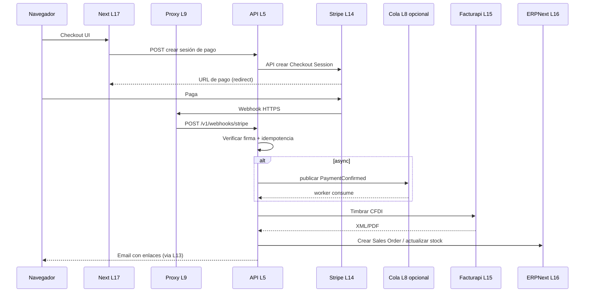

# Comunicaciones y arquitectura por componente (alto · medio · bajo nivel)

**Propósito:** dejar **sin ambigüedad** *quién habla con quién*, en **qué capa (L1–L19)** está cada pieza, si es **microservicio**, **módulo** o **infra**, y la arquitectura en **tres niveles de zoom** (L19 = IA/ML opcional).

**Documentos relacionados:** mapa visual único [MAPA-STACK-OSS-UNIFICADO-CAPAS-MICROS-ADAPTADORES.md](MAPA-STACK-OSS-UNIFICADO-CAPAS-MICROS-ADAPTADORES.md) · capas y catálogo [PLAN-STACK-OSS-CAPAS-ETAPAS-E-INTEGRACION.md](PLAN-STACK-OSS-CAPAS-ETAPAS-E-INTEGRACION.md) · código actual [ARQUITECTURA-MICROSERVICIOS-MODULOS-Y-ADAPTADORES.md](ARQUITECTURA-MICROSERVICIOS-MODULOS-Y-ADAPTADORES.md) · Compose [MICROSERVICIOS-Y-DOCKER.md](MICROSERVICIOS-Y-DOCKER.md).

---

## Definición de los tres niveles

| Nivel | Qué describe | Ejemplo |
|-------|----------------|---------|
| **Alto** | Rol en el negocio o en la entrega; vecinos lógicos; **no** puertos ni archivos. | “La API orquesta pago confirmado y dispara factura.” |
| **Medio** | Protocolos (HTTP, SMTP, Git, webhook), **dirección** del flujo, **límites** (microservicio vs monolito), variables de entorno **por nombre** (no secretos). | “Browser → `POST https://api…/v1/leads/email` con CORS.” |
| **Bajo** | Rutas concretas, archivos en repo, puertos default, nombres de env en UnClic **hoy**. | `services/api/src/app.ts`, `PING_SERVICE_URL`. |

---

## 1. Matriz maestra de comunicación (origen → destino)

Usa esta tabla antes de implementar: si una celda no tiene fila, **esa comunicación no existe aún** o es **opcional**.

| Origen | Destino | Capas tocadas | Protocolo | Autenticación típica | Notas |
|--------|---------|---------------|-----------|------------------------|-------|
| Desarrollador | Gitea | L1 | Git SSH/HTTPS | SSH key / usuario | Push de código. |
| Gitea | Jenkins | L1→L2 | HTTP webhook POST | Secret en webhook / HMAC si lo configuras | Dispara pipeline en push/tag. |
| Jenkins | Gitea/clone | L2→L1 | Git fetch | Credencial Jenkins | Checkout del commit a construir. |
| Jenkins | Docker Registry | L2→L4 | `docker push` | `docker login` (user/token) | Publica imagen etiquetada. |
| Jenkins | Runtime (host/Coolify) | L2→L5 | SSH, API Coolify, o `docker compose pull && up` | Clave/API | **No** es HTTP desde Jenkins al ERP. |
| Registry | Host de runtime | L4→L5 | `docker pull` | Mismo login o pull anónimo | Despliegue. |
| Navegador | Proxy (Caddy/Nginx/Traefik) | L9 | HTTPS TLS 443 | Certificado (Let’s Encrypt, etc.) | Terminación TLS. |
| Proxy | Next (estático) | L9→L17 | HTTP interno | Red privada / localhost | Sirve `out/` o contenedor nginx. |
| Proxy | API UnClic | L9→L5 | HTTP interno o HTTPS | Opcional mTLS / API key en header | Subdominio `api.` recomendado. |
| Navegador | API UnClic | L5 | HTTPS + CORS | Ninguna pública en leads; futuro JWT/API key | `NEXT_PUBLIC_UNCLIC_API_URL` apunta aquí en export. |
| Navegador | Next (misma origin) | L17 | HTTPS | Cookie/sesión si añades auth | Dev: `POST /api/lead-email` solo con `next dev`. |
| API | Ping | L5→L5 | HTTP GET JSON | Ninguna (red Docker) | Orquestación salud. |
| API | SMTP (Gmail, etc.) | L5→L13 | SMTP TLS 587/465 | Usuario + app password | Leads y futuros avisos. |
| API | PostgreSQL | L5→L6 | TCP SQL | Usuario/clave en env | **Pendiente** si aún no hay DB en API. |
| API | Redis | L5→L7 | TCP Redis | Password opcional | **Opcional** cache/sesión. |
| API | Cola (NATS/Rabbit/LavinMQ) | L5→L8 | AMQP / NATS | Usuario o token | **Opcional** async post-webhook; LavinMQ = AMQP como RabbitMQ. |
| Stripe / Whop | API | L14→L5 | HTTPS POST webhook | Firma webhook (Stripe-Signature, etc.) | **Entrada** asíncrona; debe ser URL pública. |
| API | Stripe / Whop | L5→L14 | HTTPS REST | Secret key servidor | Crear sesión de pago, reembolsos. **Pendiente** en código. |
| API | Facturapi / PAC | L5→L15 | HTTPS REST | API key / token | Timbrado CFDI. **Pendiente** en código. |
| API | ERPNext (Frappe) | L5→L16 | HTTPS REST | API key / token OAuth | Crear Sales Order, sincronizar ítems. **Pendiente** en código. |
| Keycloak | Proxy / apps | L10→L9/L5 | OIDC redirect | Client id/secret | **Opcional** login único. |
| API / Node | Prometheus | L5→L12 | HTTP scrape / push | Red interna | **Opcional** métricas. |
| API / worker | Ollama (inferencia) | L5→L19 | HTTP local (p. ej. 11434) | Red privada / API key interna | **Opcional**; no exponer a Internet sin auth. |
| API / worker | Docker Model Runner | L5→L19 | HTTP local (TCP habilitado; ver doc API) | Red privada | Misma capa L19; APIs compatibles OpenAI/Ollama según [referencia Docker](https://docs.docker.com/ai/model-runner/api-reference/). |
| n8n (self-host) | API / Ollama / DMR | L19→L5/L19 | HTTP webhook / REST | Secretos en n8n | Patrones tipo “agente + herramientas” (tutoriales OSS AI). |
| Worker Python | LangGraph + Ollama o DMR | L19 | HTTP / librería | Mismo host o red Docker | **Pendiente**; proceso aparte del `@unclic/api` si usas Python. |

---

## 2. Inventario: componente → capa → microservicio o módulo

| Componente | Capa principal | Tipo en arquitectura | Microservicio (proceso) | Módulo lógico (dentro del proceso) |
|------------|----------------|----------------------|---------------------------|-------------------------------------|
| Gitea | L1 | Infra / app OSS | Proceso `gitea` (binario) | Repos, PRs, webhooks (config UI) |
| Jenkins | L2 | Infra / app OSS | Proceso `jenkins` | Jobs, pipelines, cred store |
| Docker Registry | L4 | Infra | `registry:2` o Harbor | — |
| Caddy / Traefik / Nginx | L9 | Infra | Proceso proxy | Virtual hosts, `location`, TLS |
| Next.js (UnClic) | L17 | **Parte del producto**; en export es **assets + JS** | Build estático; *opcional* contenedor nginx sirviendo `out/` | Páginas, formularios, `app/api/*` solo en dev |
| `@unclic/api` | L5 | **Microservicio** | `node` + Hono en `services/api` | Rutas REST, CORS, leads, orquestación; *futuro* checkout webhook |
| `@unclic/ping` | L5 | **Microservicio** | `node` en `services/ping` | Solo health demo |
| PostgreSQL app | L6 | Infra / datos | `postgres` | Esquemas: órdenes, outbox, usuarios… |
| Redis | L7 | Infra | `redis` | Cache, rate limit |
| NATS / RabbitMQ / LavinMQ | L8 | Infra | broker | Topics/colas AMQP o NATS: `payment.confirmed`, etc. |
| Keycloak | L10 | Infra OSS | `keycloak` | Realms, clients |
| Prometheus / Grafana | L12 | Infra OSS | `prometheus`, `grafana` | Scrapes, dashboards |
| SMTP (Gmail) | L13 | Servicio externo | — | — |
| Stripe / Whop | L14 | SaaS | — | — |
| Facturapi | L15 | SaaS | — | — |
| ERPNext | L16 | OSS + stack propio | `frappe-bench` / contenedores | ERP modules (Sales, Stock, regionalización MX) |
| Ollama / Docker Model Runner | L19 | Infra o feature Docker | Binario Ollama o Docker Desktop + plugin Linux | Inferencia local; API privada hacia `@unclic/api` o workers |

**Regla:** **microservicio** = un **proceso** y **imagen** desplegable por separado. **Módulo** = carpeta o capa **dentro** de ese proceso (ej. `mail.ts` + ruta leads en la API).

---

## 3. Arquitectura por componente (alto · medio · bajo)

### 3.1 Gitea (L1)

| Nivel | Contenido |
|-------|-----------|
| **Alto** | Fuente de verdad del **código**; dispara **integración continua**; no participa en el flujo de venta del cliente final. |
| **Medio** | Expone **Git** (clone/push) y **HTTP API**; envía **webhooks** a Jenkins (URL + evento push/tag). Los desarrolladores no hablan con ERPNext vía Gitea. |
| **Bajo** | Instalación: binario o Docker oficial Gitea; en UnClic el código vive bajo `unclic/` en el monorepo que clones en Gitea. Webhook payload: JSON estándar Gitea → plugin o Generic Webhook en Jenkins. |

---

### 3.2 Jenkins (L2)

| Nivel | Contenido |
|-------|-----------|
| **Alto** | **Compila, prueba y empaqueta** (p. ej. imagen Docker) a partir de un commit; no ejecuta la tienda en producción salvo que el pipeline despliegue. |
| **Medio** | Lee repo por **Git**; ejecuta shell/Maven/npm/`docker build`; **push** a registry; opcionalmente SSH/API al servidor de deploy. |
| **Bajo** | En este monorepo puede existir `Jenkinsfile` en raíz o en `unclic/` según job; credenciales en Jenkins (Docker registry, Gitea). No codificar secretos en el repo. |

---

### 3.3 Docker Registry (L4)

| Nivel | Contenido |
|-------|-----------|
| **Alto** | Almacén de **imágenes versionadas** que el runtime descarga para ejecutar API, ping, futuros workers. |
| **Medio** | Protocolo **Docker Registry HTTP API**; `docker push` desde CI, `docker pull` desde host/K8s/Coolify. |
| **Bajo** | Imágenes típicas: `unclic-api:tag`, `unclic-ping:tag`; tags por commit o semver. |

---

### 3.4 Proxy inverso — Caddy / Traefik / Nginx (L9)

| Nivel | Contenido |
|-------|-----------|
| **Alto** | **Única puerta** desde Internet: TLS, nombres de host, enrutamiento a sitio estático y a API. |
| **Medio** | `unclic.consulting` → archivos estáticos o contenedor front; `api.unclic.consulting` → upstream puerto API; headers `Host`, timeouts, opcional rate limit. |
| **Bajo** | Upstreams: `127.0.0.1:3001` (API), carpeta `out/` o contenedor :80. Webhooks Stripe deben llegar a **ruta pública** en API, ej. `POST /v1/webhooks/stripe`. |

---

### 3.5 Next.js — sitio UnClic (L17)

| Nivel | Contenido |
|-------|-----------|
| **Alto** | **UI pública**: marketing, formularios, checkout *futuro*; no debe contener secretos; no es el sistema de registro contable. |
| **Medio** | Con **`output: 'export'`**, producción = **HTML/JS estático**. El navegador llama a la API en **otro origen** si `NEXT_PUBLIC_UNCLIC_API_URL` está definida (**CORS** en API). En **dev**, Route Handlers pueden simular la API. |
| **Bajo** | Raíz `unclic/`, `next.config.js` con `output: 'export'`; formulario de leads usa fetch a `${NEXT_PUBLIC_UNCLIC_API_URL}/v1/leads/email` o ruta interna en dev. Build: `npm run build` → `out/`. |

---

### 3.6 Microservicio `@unclic/api` (L5)

| Nivel | Contenido |
|-------|-----------|
| **Alto** | **Backend propio**: validación, integraciones salientes (correo, *futuro* pagos/fiscal/ERP), agregación de salud; **único** receptor razonable de **webhooks** de terceros. |
| **Medio** | **Hono** + **REST JSON**; **CORS** desde `CORS_ORIGINS`; rutas versionadas `/v1/...`; llama a **ping** vía HTTP usando `PING_SERVICE_URL`; correo vía **Nodemailer** + SMTP por env. |
| **Bajo** | Código: `services/api/src/app.ts` (rutas), `services/api/src/smtp.ts`, `services/api/src/mail.ts`, `services/api/src/adapters/ping-adapter.ts`. Contrato: `services/api/openapi/openapi.yaml`. Endpoints hoy: `GET /health`, `GET /v1/info`, `GET /v1/orchestration/health`, `POST /v1/leads/email`. Puerto dev típico **3001**. Futuros: `POST /v1/webhooks/stripe` → validar firma → cola o tabla → `InvoicePort` → Facturapi. |

**Descomposición interna sugerida (módulos dentro del mismo microservicio hasta que duela escalar):**

| Módulo (lógico) | Responsabilidad | Rutas / archivos hoy | Futuro |
|-----------------|-----------------|----------------------|--------|
| HTTP / CORS | Entrada | `app.ts` middleware | — |
| Leads | Captura correo | `POST /v1/leads/email`, `mail.ts` | — |
| Orquestación salud | Agregar ping | `GET /v1/orchestration/health`, `ping-adapter.ts` | Más servicios → mismo patrón adaptador |
| Pagos | Sesión + webhook | — | `adapters/stripe-adapter.ts`, ruta webhook |
| Fiscal | CFDI | — | `adapters/facturapi-adapter.ts` |
| ERP | Sales order / sync | — | `adapters/erpnext-adapter.ts` |

---

### 3.7 Microservicio `@unclic/ping` (L5)

| Nivel | Contenido |
|-------|-----------|
| **Alto** | **Demostración** de segundo proceso en red Docker y contrato HTTP mínimo. |
| **Medio** | Expone **GET** de salud; la API lo **consume** para probar conectividad. |
| **Bajo** | `services/ping/`, puerto típico **3010**; en Compose nombre DNS `http://ping:3010`. |

---

### 3.8 PostgreSQL (L6) — aplicación

| Nivel | Contenido |
|-------|-----------|
| **Alto** | Persistencia **transaccional** de órdenes, estados de pago, idempotencia de webhooks, outbox. |
| **Medio** | TCP 5432; la API usa **pool**; migraciones (Prisma/Knex/sql) en el repo del API. |
| **Bajo** | **Pendiente** de cablear en `services/api` si aún no hay `DATABASE_URL`; cuando exista, no compartir DB con ERPNext. |

---

### 3.9 Redis (L7)

| Nivel | Contenido |
|-------|-----------|
| **Alto** | Cache, rate limiting, sesiones si añades auth en API. |
| **Medio** | TCP 6379; cliente desde Node. |
| **Bajo** | **Opcional**; variable `REDIS_URL` cuando se adopte. |

---

### 3.10 Cola — NATS / RabbitMQ / LavinMQ (L8)

| Nivel | Contenido |
|-------|-----------|
| **Alto** | Desacoplar **webhook rápido** de trabajo lento (factura, ERP, emails masivos). |
| **Medio** | API publica evento `PaymentConfirmed`; worker consume y llama adaptadores. **LavinMQ** u **RabbitMQ**: mismo patrón **AMQP**; elige uno por operación (LavinMQ suele ser más liviano; ver [docs.lavinmq.com](https://docs.lavinmq.com/)). |
| **Bajo** | Añadir servicio en `docker-compose.yml`; publisher en ruta webhook; consumer en nuevo proceso o mismo API con worker mode (**decisión de diseño**). |

---

### 3.11 Keycloak (L10)

| Nivel | Contenido |
|-------|-----------|
| **Alto** | **Identidad** centralizada; login para paneles internos o B2B. |
| **Medio** | OIDC: redirect browser → Keycloak → token JWT → API valida JWKS. |
| **Bajo** | Proxy delante de rutas `/admin/*` o subdominio; middleware en Hono validando JWT. **Opcional** en E1–E2. |

---

### 3.12 Prometheus / Grafana (L12)

| Nivel | Contenido |
|-------|-----------|
| **Alto** | **Observabilidad**: métricas y tableros; no parte del flujo de venta. |
| **Medio** | Export `/metrics` en API o sidecar; Prometheus scrape; Grafana datasource. |
| **Bajo** | Librería `prom-client` en Node; endpoint dedicado en firewall interno. |

---

### 3.13 SMTP — Gmail u otro (L13)

| Nivel | Contenido |
|-------|-----------|
| **Alto** | Envío de **correo transaccional** (lead, confirmación de pedido). |
| **Medio** | API abre conexión **TLS** a proveedor SMTP; credenciales solo en **servidor**. |
| **Bajo** | Variables `GMAIL_*` / equivalentes según [LEADS-CORREO-GMAIL-SMTP.md](LEADS-CORREO-GMAIL-SMTP.md); código `smtp.ts`, `mail.ts`. |

---

### 3.14 Stripe / Whop / Monetario (L14) — SaaS

| Nivel | Contenido |
|-------|-----------|
| **Alto** | **Cobro** al cliente; la **verdad de pago** la tiene el proveedor; tu sistema reacciona a **webhooks** y consultas API. |
| **Medio** | Flujo típico: API crea **Checkout Session** o PaymentIntent → cliente paga en hosted page → **webhook** `checkout.session.completed` → API idempotente → dispara fiscal/ERP. Whop/Monetario: mismo patrón con su SDK y firma de webhook. |
| **Bajo** | Ruta pública HTTPS; cabecera firma (p. ej. `Stripe-Signature`); secretos `STRIPE_SECRET_KEY`, `STRIPE_WEBHOOK_SECRET` en env **solo API**; **nunca** en Next público. |

---

### 3.15 Facturapi / PAC (L15) — SaaS

| Nivel | Contenido |
|-------|-----------|
| **Alto** | Generar **CFDI** válido (software, bienes, según catálogos SAT y reglas del proveedor). |
| **Medio** | REST JSON; API UnClic envía payload fiscal tras pago confirmado; recibe XML/PDF; opcional envío por correo. |
| **Bajo** | `FACTURAPI_API_KEY` (ejemplo) en API; módulo `adapters/facturapi-adapter.ts`; manejo de errores y reintentos. |

---

### 3.16 ERPNext (L16) — OSS

| Nivel | Contenido |
|-------|-----------|
| **Alto** | **Back office**: clientes, productos, inventario, contabilidad; puede ser **fuente de maestros** o **registro** post-venta según diseño. |
| **Medio** | **Frappe REST API** + API Key o OAuth; llamadas desde **solo servidor** (API UnClic); sincronización batch vs tiempo real según carga. |
| **Bajo** | URL base `https://erp.tu-dominio.com`, headers `Authorization: token api_key:api_secret`; endpoints típicos `resource/Customer`, `resource/Sales Order` (ver doc Frappe/ERPNext). **No** exponer keys al navegador. |

---

### 3.17 Pila IA / ML / agentes (L19) — OSS opcional

| Nivel | Contenido |
|-------|-----------|
| **Alto** | Capacidades **inteligentes** (resúmenes, clasificación, copilotos internos) **sin** sustituir ERP ni fiscal; datos sensibles solo con política explícita. |
| **Medio** | **Ollama** o **Docker Model Runner** en red privada (DMR: habilitar TCP en Docker Desktop / usar plugin en Linux); **n8n** orquesta webhooks hacia API o hacia el endpoint de inferencia; **LangGraph** en worker aparte si el stack es Python; **MLflow** para tracking, no para checkout. |
| **Bajo** | Puerto típico Ollama `11434`; DMR: seguir puerto y rutas de la [API DMR](https://docs.docker.com/ai/model-runner/api-reference/) (solo localhost/VPC); catálogo en [PLAN-STACK-OSS-CAPAS-ETAPAS-E-INTEGRACION.md](PLAN-STACK-OSS-CAPAS-ETAPAS-E-INTEGRACION.md) §L19. |

---

## 4. Diagrama de secuencia referencia: venta + webhook + fiscal + ERP (objetivo)

Cuando implementes P1–P2–P5, el orden temporal debe ser este (ajusta nombres de eventos):

---

## 5. Qué **no** hacer (evita arquitectura confusa)

1. **No** enrutar webhooks de Stripe solo al Next estático exportado: **no hay Node** escuchando en el bucket estático.  
2. **No** hacer que Jenkins llame a ERPNext por cada venta: la venta es **runtime API + SaaS**.  
3. **No** compartir la misma base PostgreSQL entre **ERPNext** y **API UnClic** (acoplamiento y riesgo).  
4. **No** poner secretos de Facturapi/Stripe en variables `NEXT_PUBLIC_*`.  
5. **No** enviar datos personales, fiscales o secretos a un LLM (Ollama u otro) sin **evaluación de riesgo** y redacción/anonymización acordadas.  

---

## 6. Mantenimiento

Al añadir un microservicio nuevo: una fila en **§2**, filas en **§1** desde/hacia ese servicio, y subsección **§3.x** con alto/medio/bajo. Actualiza [MAPA-STACK-OSS-UNIFICADO-CAPAS-MICROS-ADAPTADORES.md](MAPA-STACK-OSS-UNIFICADO-CAPAS-MICROS-ADAPTADORES.md) si cambia el grafo global.
