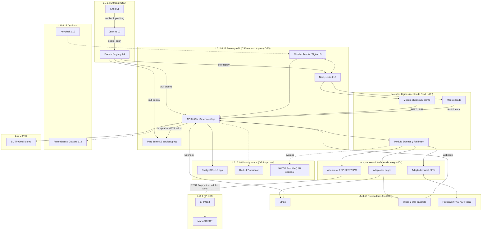
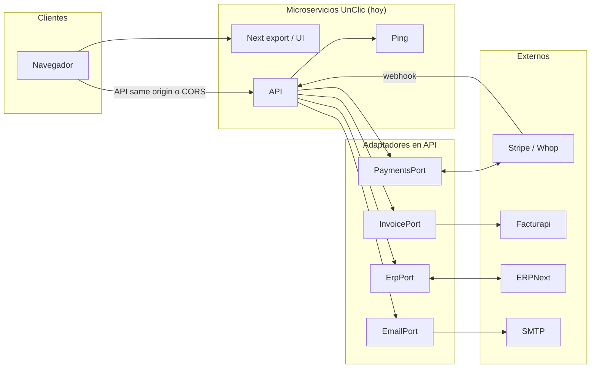

# Mapa unificado: stack OSS por capas, microservicios, módulos y adaptadores

**Propósito:** una **sola vista** de cómo encajan **Gitea, Jenkins, registry, UI (Next), API, ERP open source (p. ej. ERPNext), colas, identidad y observabilidad**, y cómo **los pagos y la facturación** (casi siempre **SaaS**, no OSS) entran por **adaptadores** sin acoplar el dominio.

> **No sustituye** el detalle por capa/herramienta en [PLAN-STACK-OSS-CAPAS-ETAPAS-E-INTEGRACION.md](PLAN-STACK-OSS-CAPAS-ETAPAS-E-INTEGRACION.md), ni el **estado real del repo** en [PLAN-OSS-ESTADO-E-EJECUCION-GRANULAR-UNClic.md](PLAN-OSS-ESTADO-E-EJECUCION-GRANULAR-UNClic.md), ni el **código actual** en [ARQUITECTURA-MICROSERVICIOS-MODULOS-Y-ADAPTADORES.md](ARQUITECTURA-MICROSERVICIOS-MODULOS-Y-ADAPTADORES.md). Es el **mapa mental único** para discutir integraciones. Para **elegir entre herramientas que se solapan** y **4 arquetipos de despliegue** en servidor propio, ver [CURACION-DUPLICADOS-Y-ELECCION-UNClic.md](CURACION-DUPLICADOS-Y-ELECCION-UNClic.md) y [PLANES-CURADOS-CUATRO-ARQUETIPOS-INTEGRACION.md](PLANES-CURADOS-CUATRO-ARQUETIPOS-INTEGRACION.md).

**Detalle de comunicaciones y arquitectura alto/medio/bajo por cada componente** (matriz origen→destino, puertos, archivos del repo, anti-patrones): **[COMUNICACIONES-Y-ARQUITECTURA-POR-COMPONENTE-NIVELES.md](COMUNICACIONES-Y-ARQUITECTURA-POR-COMPONENTE-NIVELES.md)**.

---

## Leyenda

| Símbolo / color en texto | Significado |
|--------------------------|-------------|
| **L1–L18** | Capas lógicas del plan de stack (misma numeración que el plan por capas). |
| **Caja “OSS”** | Proyecto **open source** auto-hospedable típico en este diseño. |
| **Caja “SaaS”** | **Proveedor cerrado** (Stripe, Whop, Facturapi, PAC, etc.): no es código OSS; se integra vía **API o webhook**. |
| **Adaptador** | Borde de código (módulo) que **traduce** tu dominio ↔ contrato externo (REST, webhook, SMTP, cola). Un cambio de proveedor toca **solo** el adaptador si el puerto interno está bien definido. |
| **Microservicio** | Proceso desplegable **independiente** (imagen propia, puerto propio). En el repo hoy: `services/api`, `services/ping`. |
| **Módulo** | Frontera lógica **dentro** de un servicio (leads, checkout, facturación, sync ERP…); puede moverse a otro microservicio más adelante. |

**Pagos “Monetario”, Stripe, Whop:** son **pasarelas / plataformas de venta**, no stack OSS. En el diagrama van como **SaaS** detrás del mismo tipo de **adaptador de pagos** (varias implementaciones: `StripeAdapter`, `WhopAdapter`, etc.).

**Comprobante fiscal (México, software, bienes):** el **criterio legal y el timbrado** suelen ir a **PAC / API fiscal** (p. ej. Facturapi) o a **módulos del ERP** (p. ej. e-invoice en Frappe/ERPNext). Tu **API** orquesta: *pago confirmado → datos fiscales → timbrado → entrega al cliente*.

**Capa L19 (IA / ML / agentes):** opcional; va **detrás** de la API o en **workers** (Ollama, MLflow, n8n, LangGraph, etc.). No entra en el diagrama maestro para no saturarlo; ver [PLAN-STACK-OSS-CAPAS-ETAPAS-E-INTEGRACION.md](PLAN-STACK-OSS-CAPAS-ETAPAS-E-INTEGRACION.md) §L19 y el filtro **IA / ML / agentes** en `/integraciones`.

---

## 1. Mapa maestro (una sola figura)

Flujo: **código → CI → imágenes → runtime → usuario → venta → pago/fiscal → ERP**. Las líneas **punteadas** son opcionales o fase posterior (E3+).

**Lectura rápida**

- **Gitea y Jenkins no “venden”**: publican **artefactos** que el **runtime** ejecuta. No necesitan llamar al ERP para una venta; el **sitio + API** sí.
- **Orden de venta + pago:** UI → API → **adaptador de pagos** → Stripe/Whop; el **webhook** vuelve a la **API** (no al Next estático si exportas a CDN).
- **Factura (software o bienes):** API → **adaptador fiscal** → PAC/API; opcionalmente **ERP** como fuente de maestros (cliente, producto, almacén) y como **registro contable** según tu diseño.
- **ERPNext:** suele vivir en **otro host** o stack Docker; la comunicación es **HTTP + API key / OAuth**, no “compartir base” con la app pública.

---

## 2. Vista “solo comunicaciones” (microservicios y adaptadores)

Útil para ver **quién habla con quién** sin repetir capas.

---

## 3. Tabla: capa → pieza OSS → microservicio o módulo → adaptador

| Capa | Pieza típica (OSS salvo nota) | ¿Dónde vive? | Adaptador / contrato |
|------|------------------------------|--------------|----------------------|
| L1 | Gitea | Infra propia | Webhook → Jenkins |
| L2 | Jenkins | Infra propia | Pipeline lee Git; empuja a registry |
| L4 | Registry | Infra propia | `docker pull` en deploy |
| L5 | Node API | `services/api` | OpenAPI interna |
| L5 | Ping demo | `services/ping` | `ping-adapter.ts` |
| L9 | Caddy/Traefik | Infra | Rutas TLS, headers |
| L13 | SMTP | Infra | Envío transaccional desde API |
| L14 | Stripe, Whop (**SaaS**) | Fuera | Webhook + API; `PaymentsPort` |
| L15 | Facturapi / PAC (**SaaS**) | Fuera | REST; `InvoicePort` |
| L16 | ERPNext | VPS/stack aparte | REST Frappe; `ErpPort` |
| L8 | NATS / RabbitMQ / LavinMQ | Contenedor opcional | Publisher/consumer en API (AMQP: Rabbit o LavinMQ) |
| L19 | Ollama, Docker Model Runner, MLflow, n8n, LangGraph… | Worker / contenedor / VPS dedicado | HTTP interno; `LlmPort` / job queue (ver PLAN-STACK §L19) |

---

## 4. Dónde está cada tipo de “mapa” en la documentación

| Necesitas… | Documento |
|------------|-----------|
| **Este mapa** (todo en uno) | Este archivo |
| **Quién habla con quién + capa + MS/módulo + alto/medio/bajo** | [COMUNICACIONES-Y-ARQUITECTURA-POR-COMPONENTE-NIVELES.md](COMUNICACIONES-Y-ARQUITECTURA-POR-COMPONENTE-NIVELES.md) |
| Tabla **L1–L19** con herramientas OSS alternativas | [PLAN-STACK-OSS-CAPAS-ETAPAS-E-INTEGRACION.md](PLAN-STACK-OSS-CAPAS-ETAPAS-E-INTEGRACION.md) §3–§4 y §L19 |
| Diagramas **cortos** (solo CI, solo pago+fiscal, solo ERP) | Mismo plan §5.1–5.3 |
| **Hecho / pendiente** y pasos de ejecución | [PLAN-OSS-ESTADO-E-EJECUCION-GRANULAR-UNClic.md](PLAN-OSS-ESTADO-E-EJECUCION-GRANULAR-UNClic.md) |
| **Código real** + diagrama módulos actuales | [ARQUITECTURA-MICROSERVICIOS-MODULOS-Y-ADAPTADORES.md](ARQUITECTURA-MICROSERVICIOS-MODULOS-Y-ADAPTADORES.md) |
| Compose y puertos | [MICROSERVICIOS-Y-DOCKER.md](MICROSERVICIOS-Y-DOCKER.md) |

---

*Al añadir un microservicio o un proveedor de pago nuevo, actualiza §1–§2 y una fila de §3.*
