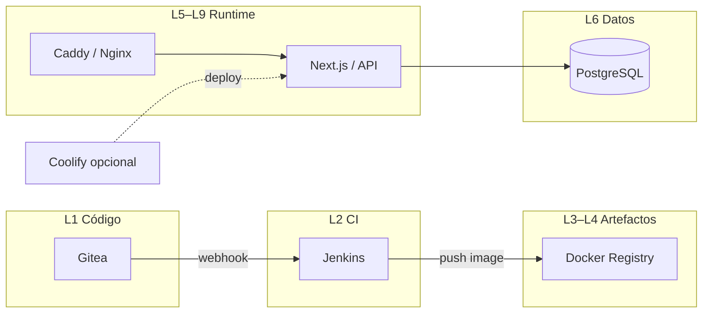
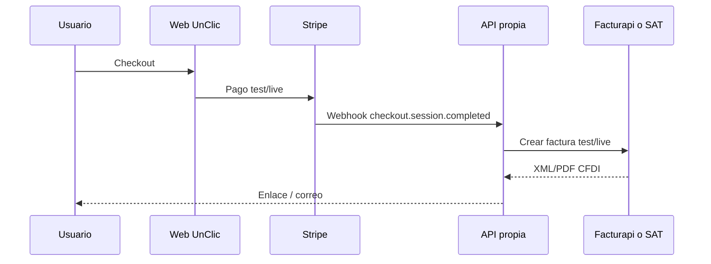
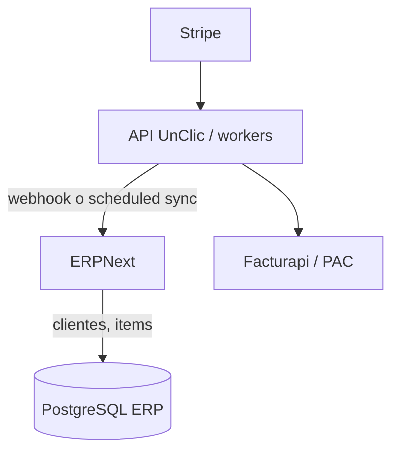

# Plan de stack: capas, etapas del software, OSS y alternativas (UnClic)

Documento vivo para **dominar e integrar** herramientas por **capa** y **etapa de madurez** del producto. Incluye **fuentes oficiales** (documentación de cada proyecto) para verificar versiones y procedimientos. Las herramientas de **pago que ya usas** aparecen como **alternativa** donde encajan.

**Mapa único (capas + microservicios + módulos + adaptadores + venta/fiscal/ERP):** **[MAPA-STACK-OSS-UNIFICADO-CAPAS-MICROS-ADAPTADORES.md](MAPA-STACK-OSS-UNIFICADO-CAPAS-MICROS-ADAPTADORES.md)**.  
**Comunicaciones explícitas + arquitectura alto/medio/bajo por componente:** **[COMUNICACIONES-Y-ARQUITECTURA-POR-COMPONENTE-NIVELES.md](COMUNICACIONES-Y-ARQUITECTURA-POR-COMPONENTE-NIVELES.md)**.

**Ejecución sin ambigüedad:** estado real del repo (Hecho / En curso / Pendiente), matriz OSS y pasos granulares E0–E5 con comandos y DoD → **[PLAN-OSS-ESTADO-E-EJECUCION-GRANULAR-UNClic.md](PLAN-OSS-ESTADO-E-EJECUCION-GRANULAR-UNClic.md)**.  
**Implementación concreta (guías + ejemplos copiables):** **[implementacion/README.md](implementacion/README.md)**.  
**Duplicados entre herramientas y default UnClic:** **[CURACION-DUPLICADOS-Y-ELECCION-UNClic.md](CURACION-DUPLICADOS-Y-ELECCION-UNClic.md)**.  
**Cuatro planes curados (UnClic + 3 arquetipos “producto mundial” → OSS en servidor propio):** **[PLANES-CURADOS-CUATRO-ARQUETIPOS-INTEGRACION.md](PLANES-CURADOS-CUATRO-ARQUETIPOS-INTEGRACION.md)**.

**Cómo usar esta guía cuando te atores**

1. Revisa **matriz y etapa** en [PLAN-OSS-ESTADO-E-EJECUCION-GRANULAR-UNClic.md](PLAN-OSS-ESTADO-E-EJECUCION-GRANULAR-UNClic.md).  
2. Identifica **capa** (§3) y **enlace oficial** (§4).  
3. Revisa el **diagrama** (§5).  
4. Si una herramienta no cabe en UnClic, créala en un **repo plantilla** (§6).

---

## 1. Principios

| Principio | Significado |
|-----------|-------------|
| **Fuente de verdad** | La doc **oficial** del producto (dominio del proyecto o `docs.*` del vendor). Esta guía **no** sustituye esas páginas. |
| **OSS primero** | Preferir software con licencia abierta **auto-hospedable**; el costo pasa a **VPS + tu tiempo**. |
| **Pago donde compense** | PAC/facturación MX, pagos con red global, o soporte crítico: a veces SaaS reduce riesgo. |
| **Integración explícita** | Cada capa expone contratos claros (HTTP, webhooks, colas, Git). |
| **OSS no implica “más seguro” solo** | Código abierto **ayuda** a revisión y comunidad, pero la seguridad real depende de **auditorías**, **mantenimiento**, **cadena de suministro**, **backing** y **operación**. Debates divulgativos (p. ej. podcast *Is Open Source Safer?* — The Linux Cast, compartido en feeds tipo daily.dev) sirven para **gestionar expectativas con clientes** que asumen OSS = automáticamente invulnerable. |
| **Plan de mantenimiento** | Cada pieza OSS en prod necesita **dueño**, **actualizaciones**, **backups** y **prueba de restore**. Una política explícita (orden de preferencia: OSS self-host → self-host cerrado → SaaS regional) aparece en [Vates — Open Source we use (2025)](https://vates.tech/blog/the-open-source-we-use-at-vates-2025-edition/); divulgación en inglés: *Building a Business on Open Source: How Vates Gets It Right* (Lawrence Systems — [hilo con enlace al vídeo](https://forums.lawrencesystems.com/t/building-a-business-on-open-source-how-vates-gets-it-right-youtube-release/24788)). |
| **Hosting consciente (nube vs propio)** | No todo es “cloud por defecto”. Criterio de **negocio estable + carga predecible + horizonte largo** vs **arranque o picos extremos**; el mito de que la nube **elimina** necesidad de ops a escala mediana se discute en 37signals — podcast [REWORK — *Leaving the Cloud*](https://37signals.com/podcast/leaving-the-cloud) (oct 2022) y [Why We’re Leaving the Cloud](https://world.hey.com/dhh/why-we-re-leaving-the-cloud-654b47e0). Resumen orientado a **desarrollador** (principios + matriz rápida): [implementacion/12-37signals-REWORK-LEAVING-CLOUD-DESARROLLADOR.md](implementacion/12-37signals-REWORK-LEAVING-CLOUD-DESARROLLADOR.md). |

**Comunidad y difusión:** artículos o eventos tipo *Open Source Global Hack Week* (p. ej. retos con **Crystal** y **LavinMQ**) son **outreach**; en **arquitectura UnClic** la pieza reutilizable es el **broker** (L8), no el lenguaje del implementador, salvo que tu equipo ya estandarice Crystal.

---

## 2. Etapas del software (madurez operativa)

Usa esto para **ordenar** qué implementar primero: base sólida antes de ERP “masivo”.

| Etapa | Descripción | Objetivo operativo |
|-------|-------------|-------------------|
| **E0 — Manual / local** | Scripts en tu máquina, builds locales, pruebas a mano. | Aprender flujos y datos sin automatizar todo. |
| **E1 — Monolito desplegable** | Una app (p. ej. Next.js) + una API opcional + una DB; un servidor o un PaaS. | **UnClic aquí primero**: sitio, leads, checkout test, CI básico. |
| **E2 — Monolito + plataforma** | Contenedores, registry, CI en servidor, reverse proxy, SSL, backups. | Mismo producto, **repetible** (Jenkins/Gitea/Docker/Nginx o Coolify). |
| **E3 — Servicios acoplados** | 2–N servicios con límites claros (API + worker + front), misma org/repo o monorepo. | “Casi microservicios”: despliegues separados, DB por servicio opcional. |
| **E4 — Microservicios / eventos** | Muchos servicios, colas, service mesh opcional, observabilidad fuerte. | Solo si el dolor de monolito ya es real. |
| **E5 — Cloud-native avanzado** | K8s multi-cluster, DR, políticas finas, coste optimizado. | Post-producto maduro o requisitos enterprise. |

**Regla:** no subir de etapa hasta tener **observabilidad mínima** y **backups** en la etapa actual.

---

## 3. Capas lógicas (qué problema resuelve cada una)

| Capa | Problema que resuelve | Interacción típica |
|------|----------------------|-------------------|
| **L1 — Código fuente** | Historial, ramas, revisión. | Git push/pull; webhooks → CI. |
| **L2 — CI (integración continua)** | Build, test, lint, empaquetado. | Lee repo; publica artefactos; notifica. |
| **L3 — Artefactos** | Binarios JAR, imágenes OCI, reportes. | CI escribe; runtime lee (pull). |
| **L4 — Registry de imágenes** | Almacén versionado de imágenes Docker. | `docker push/pull`; K8s/Coolify consumen. |
| **L5 — Runtime de aplicación** | Dónde corre el proceso (Node, JVM, contenedor). | HTTP/gRPC hacia afuera; habla con DB/cache. |
| **L6 — Datos transaccionales** | Persistencia fuerte (ACID). | SQL desde app; backups aparte. |
| **L7 — Cache / sesión** | Velocidad, rate limit, sesiones. | Redis/Memcached; TTL. |
| **L8 — Colas / async** | Trabajo diferido, desacoplo. | Productor → cola → worker. |
| **L9 — Proxy / entrada** | TLS, rutas, compresión, WAF básico. | Internet → proxy → app. |
| **L10 — Identidad / auth** | Quién es el usuario; tokens. | OAuth2/OIDC; JWT; sesiones. |
| **L11 — Secretos** | Claves fuera del código. | Runtime lee vault/env inyectado. |
| **L12 — Observabilidad** | Logs, métricas, trazas. | Agents → backend OSS; alertas. |
| **L13 — Correo transaccional** | Leads, recuperación password, avisos. | SMTP/API desde backend. |
| **L14 — Pagos** | Cobro con tarjeta/SEPA/etc. | Checkout → webhook → tu API. |
| **L15 — Facturación fiscal (MX)** | CFDI válido ante SAT. | Tu sistema → PAC/API o portal SAT. |
| **L16 — ERP / back office** | Contabilidad, inventario, CRM fuerte. | API/CSV/sync con L6 o con L14. |
| **L17 — Sitio estático / edge** | Landing, assets, SSR host. | Deploy desde Git o CI. |
| **L18 — IaC / configuración** | Infra reproducible. | Terraform/OpenTofu/Pulumi → API cloud. |
| **L19 — IA / ML / agentes (opcional)** | Inferencia local o cloud, experimentos, flujos y chatbots sin depender solo de un vendor. | API/worker → modelo (Ollama, etc.); pipelines n8n/LangGraph; tracking MLflow. |

**Nota de curación:** listados tipo *Top OSS for AI startups* (p. ej. dev.to) y panoramas en vídeo (p. ej. daily.dev / YouTube sobre “open source AI stack”) sirven para **descubrir** herramientas; la **elección por cliente** sigue siendo criterio técnico, licencia, GPU/CPU y datos sensibles (privacidad).

---

## 4. Herramientas por capa: OSS (varias opciones) + alternativas de pago

Cada fila enlaza a **documentación oficial**. Verifica siempre la versión que instalas.

### L1 — Código fuente

| OSS (opción A) | OSS (opción B) | OSS (opción C) | Pago / ya en uso |
|----------------|----------------|----------------|------------------|
| **Gitea** — [docs.gitea.com](https://docs.gitea.com/) | **GitLab CE** — [docs.gitlab.com/ee/install/](https://docs.gitlab.com/ee/install/) (self-managed) | **Forgejo** — [forgejo.org/docs](https://forgejo.org/docs/latest/) | GitHub.com, GitLab.com |

### L2 — CI/CD

| OSS | OSS | OSS | Pago / ya en uso |
|-----|-----|-----|------------------|
| **Jenkins** — [jenkins.io/doc](https://www.jenkins.io/doc/) | **Gitea Actions** — [docs.gitea.com/usage/actions](https://docs.gitea.com/usage/actions/overview) | **GitLab CI** (self-managed) — [docs.gitlab.com/ci](https://docs.gitlab.com/ee/ci/) | GitHub Actions, CircleCI |

**Lint / format en repo (alternativas OSS):** **Biome** — [biomejs.dev](https://biomejs.dev/) (JS/TS, Rust) · **Ruff** — [docs.astral.sh/ruff](https://docs.astral.sh/ruff/) (Python, útil si workers/LangGraph). No sustituyen CI; aceleran feedback local y en pipeline.

### L3 / L4 — Artefactos + Registry

| OSS | OSS | OSS | Pago / ya en uso |
|-----|-----|-----|------------------|
| **Docker Distribution** (registry v2) — [distribution.github.io/distribution](https://distribution.github.io/distribution/) | **Harbor** — [goharbor.io/docs](https://goharbor.io/docs/) | **Zot** — [project-zot.github.io](https://project-zot.github.io/) | Docker Hub, ECR, GCR |

### L5 — Runtime / PaaS self-hosted

| OSS | OSS | OSS | Pago / ya en uso |
|-----|-----|-----|------------------|
| **Coolify** — [coolify.io/docs](https://coolify.io/docs) | **Dokku** — [dokku.com/docs](https://dokku.com/docs/getting-started/installation/) | **CapRover** — [caprover.com/docs](https://caprover.com/docs/get-started.html) | Vercel, Railway, Fly.io |

**Runtime aplicación JS/TS (alternativas a Node en otros proyectos):** **Bun** — [bun.sh/docs](https://bun.sh/docs) · **Deno** — [docs.deno.com](https://docs.deno.com/). **UnClic hoy:** Node 20+ en Next y `services/api`; migrar runtime es **decisión de PoC**, no obligatoria.

### HV — Virtualización / hipervisor (datacenter propio)

Para **MSP, hosting o empresa con rack propio** (no sustituye “un VPS con Docker” salvo diseño explícito).

| OSS | Doc oficial | Notas |
|-----|-------------|--------|
| **XCP-ng** | [docs.xcp-ng.org](https://docs.xcp-ng.org/) | Plataforma hipervisor; fork ecosistema Xen; mantenido por **Vates**. |
| **Xen Orchestra (XO)** | [xen-orchestra.com/docs](https://xen-orchestra.com/docs/) | Gestión web, backups, orquestación sobre XCP-ng. |

**Compromiso y modelo de negocio (Vates):** [Open Source Commitment](https://vates.tech/en/about-vates/open-source-commitment/) — licencias GPL/AGPL, ingresos por soporte y servicios.

### L6 — Base de datos

| OSS | OSS | OSS | Pago / ya en uso |
|-----|-----|-----|------------------|
| **PostgreSQL** — [postgresql.org/docs](https://www.postgresql.org/docs/) | **MariaDB** — [mariadb.com/kb](https://mariadb.com/kb/en/documentation/) | **SQLite** (E0–E1) — [sqlite.org/docs](https://www.sqlite.org/docs.html) | RDS, Cloud SQL |
| **Turso (libSQL)** — [docs.turso.tech](https://docs.turso.tech/) | — | — | PlanetScale, Neon, Turso Cloud |
| **ClickHouse** (OLAP / data warehouse; **radar** operación analítica) — [clickhouse.com/docs](https://clickhouse.com/docs) | — | — | BigQuery, Snowflake, managed OLAP |

*Nota caso Vates 2025:* ClickHouse como **candidato** a DWH corporativo, no sustituye PostgreSQL transaccional en L6 para apps típicas UnClic.

### L7 — Cache

| OSS | OSS | Pago / ya en uso |
|-----|-----|------------------|
| **Redis** (Stack/Valkey) — [redis.io/docs](https://redis.io/docs/) / [valkey.io](https://valkey.io/documentation/) | **Memcached** — [memcached.org](https://memcached.org/) | ElastiCache |

### L8 — Colas / mensajería

| OSS | OSS | OSS | Pago / ya en uso |
|-----|-----|-----|------------------|
| **RabbitMQ** — [rabbitmq.com/documentation](https://www.rabbitmq.com/documentation.html) | **NATS** — [docs.nats.io](https://docs.nats.io/) | **Apache Kafka** — [kafka.apache.org/documentation](https://kafka.apache.org/documentation/) | SQS, Pub/Sub |
| **LavinMQ** — [docs.lavinmq.com](https://docs.lavinmq.com/) · [lavinmq.com](https://www.lavinmq.com/) (AMQP, streams, Prometheus) | — | — | CloudAMQP (servicio), otras colas managed |

### L9 — Proxy inverso / TLS

| OSS | OSS | OSS | Pago / ya en uso |
|-----|-----|-----|------------------|
| **Caddy** — [caddyserver.com/docs](https://caddyserver.com/docs/) | **Traefik** — [doc.traefik.io](https://doc.traefik.io/) | **NGINX** — [nginx.org/en/docs](https://nginx.org/en/docs/) | Cloudflare proxy (servicio), AWS ALB |

### L10 — Identidad

| OSS | OSS | Pago / ya en uso |
|-----|-----|------------------|
| **Keycloak** — [keycloak.org/documentation](https://www.keycloak.org/documentation) | **Authelia** — [authelia.com](https://www.authelia.com/) | **Zitadel** — [zitadel.com/docs](https://zitadel.com/docs) | Auth0, Clerk, **WorkOS** ([workos.com](https://workos.com/) · [pricing](https://workos.com/pricing)), Google Identity |

**Acceso remoto (complemento L10 — soporte, no SSO):** **RustDesk** — escritorio remoto con **servidor propio** (hbbs/hbbr); analogía **TeamViewer / AnyDesk**. Doc [rustdesk.com/docs](https://rustdesk.com/docs/en/) · [Docker](https://rustdesk.com/docs/en/self-host/rustdesk-server-oss/docker/) · guía UnClic [implementacion/15-RUSTDESK-REMOTO-SELF-HOST.md](implementacion/15-RUSTDESK-REMOTO-SELF-HOST.md) · divulgación [Lawrence Systems](https://www.youtube.com/watch?v=FIEcTNjFZNA).

**BaaS OSS integrado (cruza L6, L10, storage, funciones, realtime, mensajería, hosting de front — según producto):** **Appwrite** — [appwrite.io](https://appwrite.io/) · [docs](https://appwrite.io/docs). Alternativa curada a ensamblar IdP + DB + object storage + workers desde cero en **E1–E2**; cloud o self-host. **UnClic web + API Hono actual** no depende de Appwrite; usar solo con **decisión de proyecto** (ver duplicados con Keycloak/DB propia). Integración con flujos **IA / agentes** (p. ej. MCP, skills) como opción **L19**. Guía de criterios y mapeo de capas: **[APPWRITE-BAAS-REFERENCIA-UNClic.md](APPWRITE-BAAS-REFERENCIA-UNClic.md)**.

**SaaS “enterprise-ready” (SSO + directorios + bloques de producto — no OSS):** **WorkOS** — [workos.com](https://workos.com/) · [docs](https://workos.com/docs) · [pricing](https://workos.com/pricing). APIs/SDK para **Enterprise SSO** (SAML/OIDC frente a Okta, Entra ID, Google Workspace, etc.), **Directory Sync** (SCIM, HRIS), **User Management**, **AuthKit** (UI con Radix), magic link, MFA, **Admin Portal** alojado para que IT del cliente configure conexiones, audit logs, etc. Encaja cuando el **comprador exige SSO o SCIM** y el equipo quiere **integrar en semanas** en lugar de implementar SAML a mano. **No sustituye** filosofía OSS-first del sitio UnClic; es **pago**, contrato y cumplimiento dependen de WorkOS. Criterios y relación con portal JWT actual: **[WORKOS-ENTERPRISE-SSO-REFERENCIA-UNClic.md](WORKOS-ENTERPRISE-SSO-REFERENCIA-UNClic.md)**.

### L11 — Secretos

| OSS | OSS | Pago / ya en uso |
|-----|-----|------------------|
| **OpenBao** (fork OSS de Vault) — [openbao.org/docs](https://openbao.org/docs/) | **SOPS** + Git — [github.com/getsops/sops](https://github.com/getsops/sops) | **pass** / **age** (equipos pequeños) | Vault Enterprise, cloud secret managers |

### L12 — Observabilidad

| OSS | Rol | Doc oficial |
|-----|-----|-------------|
| **Prometheus** | Métricas | [prometheus.io/docs](https://prometheus.io/docs/introduction/overview/) |
| **Grafana** | Dashboards | [grafana.com/docs](https://grafana.com/docs/grafana/latest/) |
| **Loki** | Logs | [grafana.com/docs/loki](https://grafana.com/docs/loki/latest/) |
| **OpenTelemetry** | Trazas estándar | [opentelemetry.io/docs](https://opentelemetry.io/docs/) |
| **Jaeger** | Trazas distribuidas | [jaegertracing.io/docs](https://www.jaegertracing.io/docs/) |
| **NetAlertX** | Descubrimiento de dispositivos / cambios en **LAN**, plugins (UniFi, Nmap, etc.), alertas | [docs.netalertx.com](https://docs.netalertx.com/) · [Docker](https://docs.netalertx.com/DOCKER_INSTALLATION/) · guía [implementacion/14-NETALERTX-RED-DESCOBERTA-MONITOR.md](implementacion/14-NETALERTX-RED-DESCOBERTA-MONITOR.md) |

Complementa **Uptime Kuma** (HTTP/servicio) y **Netdata** (métricas host): NetAlertX = **visibilidad e inventario dinámico** en red interna; no sustituye CMDB (**NetBox**) sino que a menudo convive.

**Pago / SaaS:** Datadog, Honeycomb, etc.

### L13 — Correo

| OSS / estándar | Doc / notas | Pago / ya en uso |
|----------------|-------------|------------------|
| **Postfix** + **Dovecot** (self-host completo) | [postfix.org/documentation](https://www.postfix.org/documentation.html) | Complejo (deliverability) |
| **SMTP de Gmail** con app password | [Google Account: App passwords](https://support.google.com/accounts/answer/185833) | **Google Workspace** (ya lo usas) |
| Integración app | Ver `docs/LEADS-CORREO-GMAIL-SMTP.md` en este repo | SendGrid, Resend, SES |

### L14 — Pagos

| OSS / self-hosted | Realidad | Pago / ya en uso |
|-------------------|----------|------------------|
| No hay “Stripe open source”; hay **integración** | Tu backend llama API | **Stripe** — [stripe.com/docs](https://stripe.com/docs) |
| **Orquestación pagos OSS** | Multi-PSP, vault, routing, reconciliación | **Hyperswitch** — [hyperswitch.io](https://hyperswitch.io) · [GitHub](https://github.com/juspay/hyperswitch) |
| **Motor billing OSS** (medición, planes, facturación lógica) | Se conecta a Stripe/Adyen/GoCardless… | **Lago** — [getlago.com](https://www.getlago.com) · [GitHub](https://github.com/getlago/lago) · [docs](https://getlago.com/docs) |
| **Billing SaaS “IA + uso + MoR”** (checkout, eventos, adaptadores Next) | SaaS; precios en sitio | **Polar** — [polar.sh](https://polar.sh) · [docs](https://docs.polar.sh) |
| **BaaS / issuing** (tarjetas, core) | No sustituye checkout típico landing | **Pismo** — [pismo.io](https://pismo.io) |

**Criterios y combinaciones (Stripe vs Lago vs Polar vs Hyperswitch):** **[PAGOS-BILLING-ALTERNATIVAS-POLAR-LAGO-HYPERSWITCH-PISMO-UNClic.md](PAGOS-BILLING-ALTERNATIVAS-POLAR-LAGO-HYPERSWITCH-PISMO-UNClic.md)**.

### L15 — Facturación fiscal México (CFDI)

| Vía | Doc oficial / notas | Pago / ya en uso |
|-----|---------------------|------------------|
| **Portal SAT** (generación en línea) | Trámite en [sat.gob.mx](https://www.sat.gob.mx) / aplicativos de factura electrónica | Gratis, manual |
| **PAC / API** | Cada PAC publica su API | **Facturapi** — [docs.facturapi.io](https://docs.facturapi.io/) |

### L16 — ERP / back office

| OSS | Doc oficial | Pago / ya en uso |
|-----|-------------|------------------|
| **ERPNext** (Frappe) | [docs.erpnext.com](https://docs.erpnext.com/) y [frappeframework.com/docs](https://frappeframework.com/docs) | Odoo Enterprise, NetSuite |
| **Odoo Community** | [odoo.com/documentation](https://www.odoo.com/documentation/) | Odoo.sh |

### L17 — Frontend / SSR (UnClic)

| OSS | Doc oficial |
|-----|-------------|
| **Next.js** | [nextjs.org/docs](https://nextjs.org/docs) |
| **Astro** (alternativa contenido / docs sites) | [docs.astro.build](https://docs.astro.build/) |

### Curación “top OSS 2026” (p. ej. dev.to — *Top Open Source Projects That Will Dominate 2026*)

Lista **orientativa** (Rendimiento Rust, DX, IA en tooling). **Ninguna** sustituye análisis por cliente; varias ya están en §L2/L5/L6/L17/L19 y en el atlas del sitio (**`/integraciones`**, filtro **DX / toolchain 2026**; datos en `lib/copy.ts`).

| Proyecto | Rol | Doc / nota |
|----------|-----|------------|
| **Biome** | Lint/format JS/TS | §L2 arriba |
| **Bun** | Runtime JS/TS | §L5 arriba |
| **Deno** | Runtime TS-first | §L5 arriba |
| **Zed** | Editor OSS + IA | [zed.dev/docs](https://zed.dev/docs/) — estación de trabajo, no servidor |
| **Turso** | Edge SQLite / libSQL | §L6 arriba |
| **Ollama** | LLM local | §L19 |
| **Ruff** | Linter Python | §L2 arriba |
| **Astro** | Front contenido | §L17 arriba |
| **Continue** | Asistente código en IDE | [docs.continue.dev](https://docs.continue.dev/) — productividad equipo; política de datos con modelos |

### Caso empresa OSS (Vates + Lawrence Systems)

Referencia **primaria** (lista actualizada y política de sourcing): **[The Open Source we use at Vates: 2025 edition](https://vates.tech/blog/the-open-source-we-use-at-vates-2025-edition/)**. Divulgación en vídeo (contexto negocio, facturación/HR/colaboración): **Lawrence Systems** — [hilo del lanzamiento con enlace al YouTube](https://forums.lawrencesystems.com/t/building-a-business-on-open-source-how-vates-gets-it-right-youtube-release/24788).

**Política de sourcing (resumen del artículo Vates, orden de preferencia):**

1. Por defecto: **OSS self-hosted**.  
2. Si no hay opción viable: mejor herramienta **self-hosted** (aunque no OSS) y **revisar cada año**.  
3. Si hace falta **SaaS**: priorizar proveedores **de la región** (p. ej. UE) y **estándares abiertos** / buenas prácticas de datos.

**Idea central:** se puede **operar** una empresa mediana casi toda en OSS (ejemplo ~100 personas con misma base de servidores) y a la vez **construir** negocio vendiendo soporte sobre productos OSS (XCP-ng, Xen Orchestra). No es teoría de hobby; es modelo de **servicios + upstream**.

**Refinamiento del plan UnClic (lecciones del artículo 2025, ejecutables):**

- **Escala “horizontal” primero en procesos y herramientas**, no asumir más servidores: Vates describe ~100 personas con **la misma base de cómputo de 2019** + RAM/NVMe reacondicionados — implica disciplina de **capacidad, observabilidad y runbooks** antes de capex.  
- **Formalizar política de 3 niveles** (OSS self-host → self-host no-OSS con **revisión anual** → SaaS **regional** + estándares/datos) y **declarar excepciones** (ej. HR SaaS, nichos contables) por escrito en ofertas internas/cliente.  
- **Documentar sustituciones con causa:** Wekan→**Plane** (complejidad PM), Kibana+ES→**Metabase** (datos relacionales), Jitsi→**BBB** (escala/red + grabaciones), VuePress→**Docusaurus** (mantenimiento + búsqueda local).  
- **Gestionar riesgo de producto:** Formbricks y cambios de features (ej. SSO); piezas **bajo observación** (ej. **Zammad** por recursos, alternativas tipo **Grafana OnCall**).  
- **Radar ≠ roadmap:** ClickHouse y Open WebUI en experimentación; no prometer al cliente hasta PoC — ver [implementacion/11-EMPRESA-OSS-VATES-REFERENCIA.md](implementacion/11-EMPRESA-OSS-VATES-REFERENCIA.md).

**Herramientas citadas en 2025** (muchas ya mapeadas en capas de esta guía o en el atlas **`/integraciones`**, filtro **Operación empresa OSS**):

| Área | Ejemplos en Vates 2025 | Dónde ampliar en esta guía |
|------|-------------------------|----------------------------|
| Virtualización / backup | XCP-ng, Xen Orchestra | § **HV** arriba |
| SSO / directorio | OpenLDAP, Keycloak | §L10 |
| Chat / colaboración | Mattermost | §L12 + atlas |
| Git | Gitea | §L1 |
| Archivos | Nextcloud | Atlas + §L16 |
| CRM | EspoCRM | Atlas + §L16 |
| BI | Metabase | Atlas + §L12 |
| PM | Plane (open core) | Atlas |
| Datos tabulares | Grist | Atlas + §L6 + [implementacion/13-GRIST-HOJA-RELACIONAL-SELF-HOST.md](implementacion/13-GRIST-HOJA-RELACIONAL-SELF-HOST.md) (Docker, auth, API — Lawrence Systems + doc oficial) |
| Formularios | Formbricks | Atlas |
| Docs producto | Docusaurus | Atlas + §L17 |
| Videollamadas | BigBlueButton | Atlas |
| Secretos | Vaultwarden | Atlas + §L11 |
| Monitoreo / status | Netdata, Uptime Kuma, **NetAlertX** (LAN) | Atlas + §L12 + [implementacion/14-NETALERTX-RED-DESCOBERTA-MONITOR.md](implementacion/14-NETALERTX-RED-DESCOBERTA-MONITOR.md) |
| Acceso remoto (TeamViewer / AnyDesk) | **RustDesk** (servidor propio) | §L10 (nota acceso remoto) + [implementacion/15-RUSTDESK-REMOTO-SELF-HOST.md](implementacion/15-RUSTDESK-REMOTO-SELF-HOST.md) |
| IA UI | Open WebUI (radar) | §L19 + atlas |
| Data warehouse (radar) | ClickHouse | §L6 / analítica — evaluar doc oficial |

**Más herramientas** (NetBox, Snipe-IT, Zammad, Mautic, Ghost, NodeBB, BlueMind, Koji, Mirrorbits, Remark.js, PrivateBin, etc.): detalle en el **artículo Vates**; guía operativa resumida en [implementacion/11-EMPRESA-OSS-VATES-REFERENCIA.md](implementacion/11-EMPRESA-OSS-VATES-REFERENCIA.md).

### L18 — IaC

| OSS | Doc oficial |
|-----|-------------|
| **OpenTofu** | [opentofu.org/docs](https://opentofu.org/docs/) |
| **Terraform** (licencia cambió; ver términos) | [developer.hashicorp.com/terraform/docs](https://developer.hashicorp.com/terraform/docs) |
| **Pulumi** (open source CLI) | [pulumi.com/docs](https://www.pulumi.com/docs/) |

### L19 — IA / ML / agentes (OSS y piezas híbridas)

Herramientas que aparecen con frecuencia en **guías para startups IA** (dev.to, daily.dev, YouTube, tutoriales tipo *“Run LLMs locally with Docker Model Runner”*) y en **stacks de agentes**; encajan como **capa opcional** detrás de tu API (L5) o como **workers** aparte — no sustituyen L6–L16.

| Rol | OSS / proyecto | Doc oficial | Uso típico en cartera amplia |
|-----|----------------|-------------|------------------------------|
| **Inferencia LLM local / edge** | **Ollama** | [github.com/ollama/ollama](https://github.com/ollama/ollama) · [ollama.com](https://ollama.com/) | Qwen, Llama, etc. en VPS/GPU sin mandar datos a terceros. |
| **Inferencia LLM local (Docker-native)** | **Docker Model Runner (DMR)** | [Model Runner — Docker Docs](https://docs.docker.com/ai/model-runner/) · [Get started](https://docs.docker.com/ai/model-runner/get-started/) · [API REST](https://docs.docker.com/ai/model-runner/api-reference/) | Mismo objetivo que Ollama con **flujo Docker**: modelos desde Docker Hub / OCI; APIs compatibles OpenAI y Ollama; Docker Desktop (p. ej. ≥ 4.40 con función habilitada) o **Linux** vía plugin `docker-model-plugin`. Encaja en equipos que ya estandarizaron en Docker y quieren **100% local** sin otro runtime. |
| **Experimentos y registro ML** | **MLflow** | [mlflow.org/docs](https://mlflow.org/docs/latest/index.html) | Versionar runs, modelos, comparar equipos de datos. |
| **Entrenamiento / investigación** | **PyTorch** | [pytorch.org/docs](https://pytorch.org/docs/stable/index.html) | Deep learning desde cero o fine-tuning. |
| **Entrenamiento / producción** | **TensorFlow** | [tensorflow.org/learn](https://www.tensorflow.org/learn) | Modelos clásicos en empresas con stack Google/TF. |
| **Prototipos red neuronal** | **Keras** | [keras.io](https://keras.io/) | API de alto nivel (a menudo sobre TensorFlow). |
| **Chatbots / automatización conversacional** | **Hexabot** | [hexabot.io](https://www.hexabot.io/) (comprobar repo y licencia vigentes) | Bot multi-canal OSS; evaluar madurez antes de producción. |
| **UI generativa (Stability)** | **Stable Studio** | [GitHub Stability-AI / stable-studio](https://github.com/Stability-AI/stable-studio) | Front para flujos generativos; más “producto creativo” que ERP. |
| **LLM en escritorio / local** | **GPT4All** | [gpt4all.io](https://gpt4all.io/) | Modelos locales y privacidad en equipos de cliente. |
| **Orquestación low-code / agentes** | **n8n** | [docs.n8n.io](https://docs.n8n.io/) | Workflows; encaja con demos tipo “analizador financiero + Ollama” (patrón común en tutoriales OSS AI). |
| **Grafos de agentes (código)** | **LangGraph** | [langchain-ai.github.io/langgraph](https://langchain-ai.github.io/langgraph/) | Multi-agente, estado, bucles; tu API llama al grafo o worker dedicado. |
| **UI chat self-host (empresa)** | **Open WebUI** | [docs.openwebui.com](https://docs.openwebui.com/) | Interfaz tipo ChatGPT sobre Ollama / APIs OpenAI-compat; en **radar** en [Vates 2025](https://vates.tech/blog/the-open-source-we-use-at-vates-2025-edition/) (experimentación con **GPU dedicada**, p. ej. 8×16 GiB en su relato). |

**Híbrido (no es OSS del modelo):** **OpenAI Agents SDK** — [OpenAI Agents SDK docs](https://openai.github.io/openai-agents-python/) — útil cuando el cliente mezcla **API comercial** con **modelos abiertos vía Ollama o DMR** (este último expone API estilo OpenAI en localhost cuando activas TCP, p. ej. puerto documentado en la referencia de API).

**Ollama vs Docker Model Runner:** no son excluyentes; a veces conviene **uno u otro** por política del cliente (solo Docker vs binario Ollama), por GPU (vLLM en DMR en Linux según doc) o por integración con **SDK abierto** desde Python en el mismo tutorial. En arquitectura UnClic ambos son **L19** detrás de red privada + adaptador en API.

**Regla UnClic:** L19 **después** de tener API estable, CORS y observabilidad básica; los datos personales o fiscales no deben pasar por un LLM sin **evaluación de riesgo** explícita.

**Curación vídeo / agentes (Fireship, 2026):** siete proyectos (Agency Agents, PromptFoo, MiroFish, NanoChat, Impeccable, Heretic, OpenViking) con **plan granular**: instalación (Docker / pip / npm / solo archivos), hosting, modos de interacción (CLI, HTTP, IDE, proxy API) y DoD por herramienta → **[L19-FIRESHIP-7-HERRAMIENTAS-IA-OSS-SELF-HOST-Y-INTERACCION.md](L19-FIRESHIP-7-HERRAMIENTAS-IA-OSS-SELF-HOST-Y-INTERACCION.md)**.

---

## 5. Diagramas (referencia rápida)

Para **una sola figura** que une entrega (Gitea/Jenkins), runtime (Next/API), módulos, adaptadores, pagos/fiscal (SaaS) y ERPNext, ver **[MAPA-STACK-OSS-UNIFICADO-CAPAS-MICROS-ADAPTADORES.md](MAPA-STACK-OSS-UNIFICADO-CAPAS-MICROS-ADAPTADORES.md)**. Las subsecciones siguientes son **vistas parciales** más legibles.

### 5.1 Flujo de datos: desarrollo → producción (E2 típico UnClic / FastFlow)

### 5.2 Flujo comercial: pago + factura (México)

### 5.3 ERP como núcleo operativo (futuro E3+)

---

## 6. Estrategia de implementación en UnClic vs plantillas demo

Los **estados Hecho/En curso/Pendiente** y los **pasos por etapa (E0–E5)** viven en **[PLAN-OSS-ESTADO-E-EJECUCION-GRANULAR-UNClic.md](PLAN-OSS-ESTADO-E-EJECUCION-GRANULAR-UNClic.md)**. La tabla siguiente resume prioridades; al implementar, sigue la matriz y el backlog del doc granular.

| Prioridad | Qué integrar en **este repo UnClic** | Qué dejar en **repo plantilla** |
|-----------|--------------------------------------|----------------------------------|
| **P0** | Next.js, leads (Next route en dev **o** `services/api` + `NEXT_PUBLIC_UNCLIC_API_URL` en prod estática), `services/ping` + orquestación `GET /v1/orchestration/health`, `npm run test:services`, [ARQUITECTURA-MICROSERVICIOS-MODULOS-Y-ADAPTADORES.md](ARQUITECTURA-MICROSERVICIOS-MODULOS-Y-ADAPTADORES.md) | — |
| **P1** | Webhook Stripe test + cola de “órdenes” en memoria o SQLite | Plantilla “SaaS mínimo” con Stripe + mismo patrón |
| **P2** | Facturapi test desde API route (cuando haya presupuesto) | Plantilla “MX billing” con Facturapi mock |
| **P3** | Despliegue documentado: Coolify **o** Jenkins+Registry+Nginx (ya en toolkit FastFlow) | Repo “infra mínima” Terraform/OpenTofu |
| **P4** | Keycloak **o** Authelia delante de demos sensibles | Plantilla “auth gateway” |
| **P5** | ERPNext en VPS aparte + solo documentar integración API | Repo “erpnext-docker-compose” con README y enlaces oficiales |

**Regla:** si una herramienta **no cabe** en el mismo `package.json` o runtime, el **alcance** va a un **repositorio demo** con README que enlace **aquí** y a la **doc oficial**.

---

## 7. Checklist “funcionará a la primera”

Antes de dar por cerrada una capa:

- [ ] Leí la sección **Getting started** de la **doc oficial** del producto.  
- [ ] Versioné imagen o paquete (**tag explícito**, no `latest` en prod).  
- [ ] Probé **rollback** (imagen anterior en registry).  
- [ ] **Secretos** fuera del repo (`.env.local`, vault, CI credentials).  
- [ ] **Backup** de L6 documentado (pg_dump, snapshots).  
- [ ] Para **MX CFDI**: datos fiscales alineados con constancia; PAC o SAT probado en **test** primero.

---

## 8. Referencias oficiales SAT (México)

- Portal y trámites: [sat.gob.mx](https://www.sat.gob.mx)  
- Factura electrónica / CFDI: usar siempre los **aplicativos y guías** publicados por el SAT para la versión vigente del CFDI (catálogos, Anexo 20, etc.). No copies procedimientos de blogs sin contrastar con **normativa y aplicativo actual**.

---

## 9. Mantenimiento de este documento

- Al añadir una herramienta: **capa**, **etapa mínima**, **enlace oficial**, **cómo habla** con las demás.  
- Si un enlace oficial cambia, actualizar la tabla; no depender de mirrors ajenos.

---

*Última actualización orientativa: marzo 2026. Verifica versiones en las URLs oficiales antes de implementar.*
